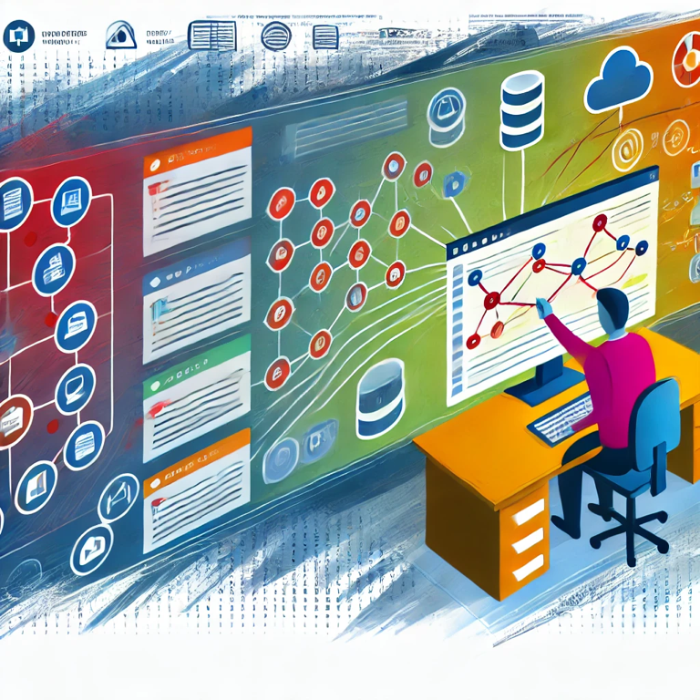

## **"Data, Data Everywhere: How Do You Keep Track?"**

Hey everyone,

Ever feel like your data is playing a game of hide and seek? One minute it’s here, the next it’s somewhere else—or worse, gone completely. If you’re anything like me, you’ve got data spread across multiple systems, apps, and services. But how do you keep tabs on it all? How do you know when something changes, appears, or disappears? And most importantly, how do you make sure the right information gets to the right place at the right time?

<!-- truncate -->

This is a question I’ve been wrestling with lately. In a world where business applications are the backbone of everything we do, having a clear handle on your data is more important than ever. You need to know what’s happening with your data in real-time so you can act fast and keep your business running smoothly.

### **Centralizing Your Data Monitoring**

The first step is to bring everything together in one place. Easier said than done, right? But seriously, if you’re working with a mix of on-premises and cloud services (like most of us are), setting up a central dashboard or using tools that aggregate data across these systems can be a game-changer.

### **Setting Up Alerts and Notifications**

Once you’ve got a handle on where your data lives, the next step is setting up alerts. You need to know the moment something changes. Whether it’s a new entry in your database, a file being uploaded, or something being deleted, having real-time alerts means you’re always in the loop.

### **Understanding the Flow**

Data isn’t static—it moves. Understanding how data flows through your systems helps you identify where it’s coming from, where it’s going, and how it’s being transformed along the way. This insight is crucial for distributing information correctly and ensuring nothing gets lost in the shuffle.

### **Automation is Your Friend**

Let’s face it, manually tracking all this is a nightmare. That’s where automation comes in. Tools like Power Automate (yes, I know, sometimes we love it, sometimes we hate it) or custom scripts can help you automate the monitoring and distribution of data. This frees you up to focus on the big picture.

### **Staying Flexible**

The landscape of your data is always changing, so your approach needs to be flexible too. What works today might need tweaking tomorrow, and that’s okay. The key is to stay adaptable and keep refining your process as your business needs evolve.

That’s what I’m focusing on today, and I’ll be sharing more about what I learn as I go. If you’ve got any tips, tools, or stories about how you manage your data, I’d love to hear them. Let’s figure this out together!

Until next time ...
