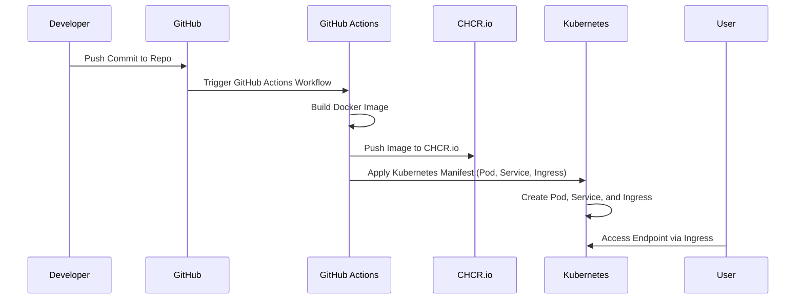

### Web app / api


### Service
```mermaid
sequenceDiagram
    participant Developer
    participant GitHub
    participant GitHubActions as GitHub Actions
    participant ContainerRegistry as CHCR.io
    participant Kubernetes
    participant NATS as NATS Cluster
    participant User

    Developer->>GitHub: Push Commit to Repo
    GitHub->>GitHubActions: Trigger GitHub Actions Workflow
    GitHubActions->>GitHubActions: Build Docker Image
    GitHubActions->>ContainerRegistry: Push Image to CHCR.io
    GitHubActions->>Kubernetes: Apply Kubernetes Manifest (Pod only)
    Kubernetes->>Kubernetes: Create Pod for NATS Microservice
    Kubernetes->>NATS: Register NATS Microservice (connect to NATS Queue)
    User->>NATS: Send Task to NATS Work Queue
    NATS->>Kubernetes: Dispatch Task to NATS Microservice Pod

````

