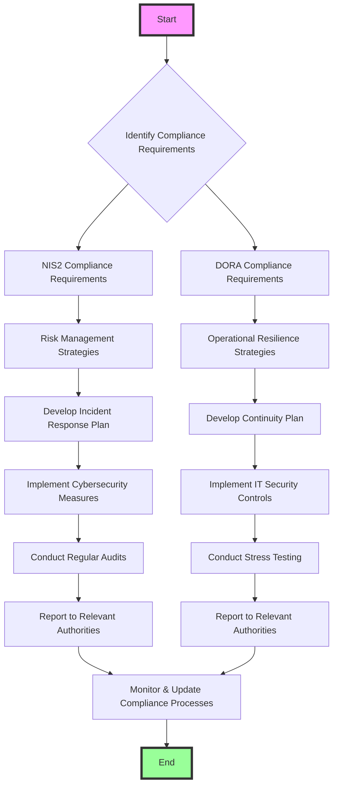

# NIS2 and DORA Compliance Process

In today's regulatory landscape, ensuring compliance with both the Network and Information Systems Directive (NIS2) and the Digital Operational Resilience Act (DORA) is crucial for organizations. These regulations require robust cybersecurity measures and operational resilience to protect against disruptions and cyber threats. This diagram outlines the key processes involved in developing compliant solutions for NIS2 and DORA, helping you align your organization's strategies with these critical requirements.

