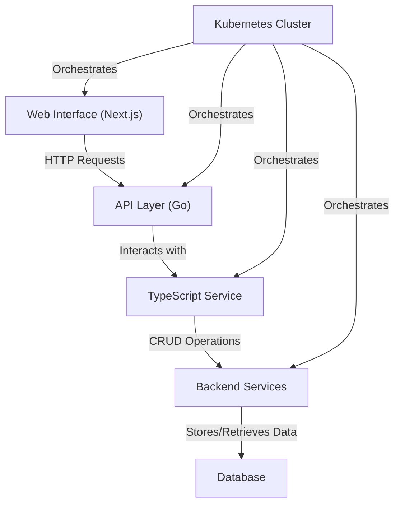
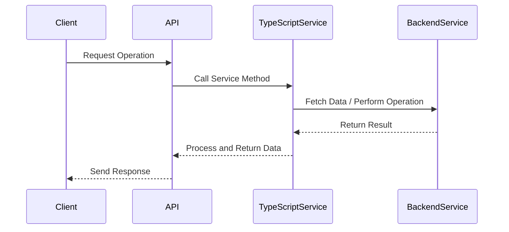
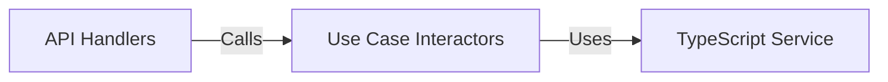
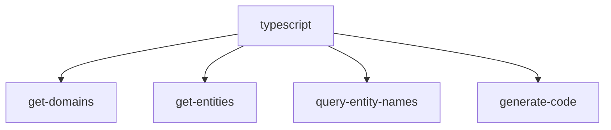

# Koksmat Studio Overview

Koksmat Studio is a powerful tool for building and managing the Koksmat Magic Platform. It consists of Magic Buttons, REST APIs, Microservices, and Batch jobs. This document provides an overview of the project structure, key components, and their interactions.

## Project Architecture

The Koksmat Studio project is built using Go for the backend services and Next.js for the web interface. It leverages Kubernetes for deployment and orchestration. The following Mermaid diagram illustrates the high-level architecture of the Koksmat Studio:



## Key Components

### 1. TypeScript Service

The TypeScript Service is a core component of Koksmat Studio, responsible for managing domains, entities, and generating TypeScript code for entity services.



The TypeScript Service provides the following key functionalities:

1. Retrieving domains and entities
2. Generating TypeScript code for entity services
3. Managing entity dependencies and relationships

### 2. Use Case Interactors

Use Case Interactors act as an intermediary layer between the API handlers and the TypeScript Service. They encapsulate the business logic and provide a clean interface for the API handlers to interact with.



Key interactors include:

- GetDomainsInteractor
- GetEntitiesInteractor
- QueryEntityNamesInteractor
- GenerateCodeInteractor
- DependOnInteractor
- UsedByInteractor

### 3. API Handlers

API Handlers set up the HTTP endpoints for the Koksmat Studio REST API. They use the Chi router and the Use Case Interactors to handle incoming requests.

Example endpoints:

- GET /typescript/domains
- GET /typescript/entities
- GET /typescript/entity-names
- POST /typescript/generate-code
- POST /typescript/depend-on
- POST /typescript/used-by

### 4. CLI Commands

Koksmat Studio provides a command-line interface (CLI) for performing various operations. The CLI is built using the Cobra library and includes commands for managing TypeScript-related operations.



## Code Generation

One of the key features of Koksmat Studio is its ability to generate TypeScript code for entity services. The generated code includes:

1. An interface representing the entity
2. A service class implementing the KoksmatCRUD interface
3. CRUD methods for interacting with the entity

Here's an example of the structure of the generated code:

```typescript
interface EntityName {
  // Entity properties
}

class EntityNameService implements KoksmatCRUD<EntityName> {
  private domain: string = "entityname";

  async create(item: EntityName): Promise<KoksmatResponse<EntityName>> {
    // Implementation
  }

  async read(id: string): Promise<KoksmatResponse<EntityName>> {
    // Implementation
  }

  async update(
    id: string,
    item: Partial<EntityName>
  ): Promise<KoksmatResponse<EntityName>> {
    // Implementation
  }

  async delete(id: string): Promise<KoksmatResponse<void>> {
    // Implementation
  }

  async list(
    page: number = 1,
    pageSize: number = 10
  ): Promise<KoksmatResponse<EntityName[]>> {
    // Implementation
  }
}
```

## Conclusion

Koksmat Studio provides a powerful and flexible platform for building and managing the Koksmat Magic Platform. By leveraging Go, Next.js, and Kubernetes, it offers a scalable and efficient solution for handling Magic Buttons, REST APIs, Microservices, and Batch jobs. The TypeScript code generation feature streamlines the development process and ensures consistency across entity services.

For more detailed information on specific components or usage instructions, please refer to the respective documentation sections.
