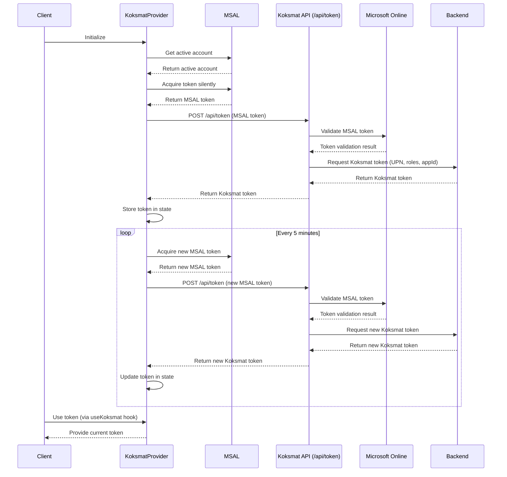

I'll create a Mermaid sequence diagram to illustrate the flow of the Koksmat Token Provider system we've just designed.

Here's a Mermaid sequence diagram showing the flow of the Koksmat Token Provider system:

This diagram illustrates the following flow:

1. The Client initializes the KoksmatProvider.
2. The KoksmatProvider interacts with MSAL to get the active account and acquire an MSAL token.
3. The KoksmatProvider sends the MSAL token to the Koksmat API.
4. The Koksmat API validates the MSAL token with Microsoft Online.
5. After validation, the Koksmat API requests a Koksmat token from the Backend.
6. The Koksmat token is returned to the KoksmatProvider and stored in its state.
7. Every 5 minutes, the KoksmatProvider initiates a token renewal process, following steps 2-6.
8. The Client can access the current Koksmat token at any time using the useKoksmat hook.

This diagram provides a clear visual representation of how the different components in the Koksmat Token Provider system interact, including the token renewal process.
