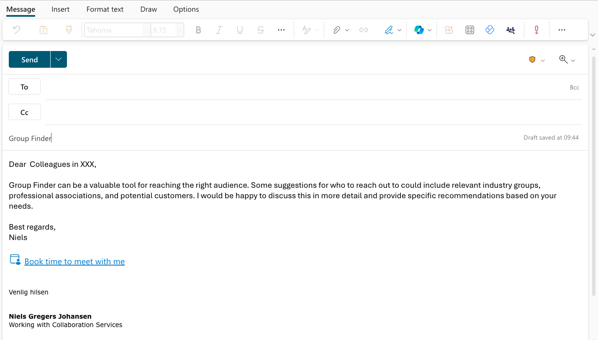
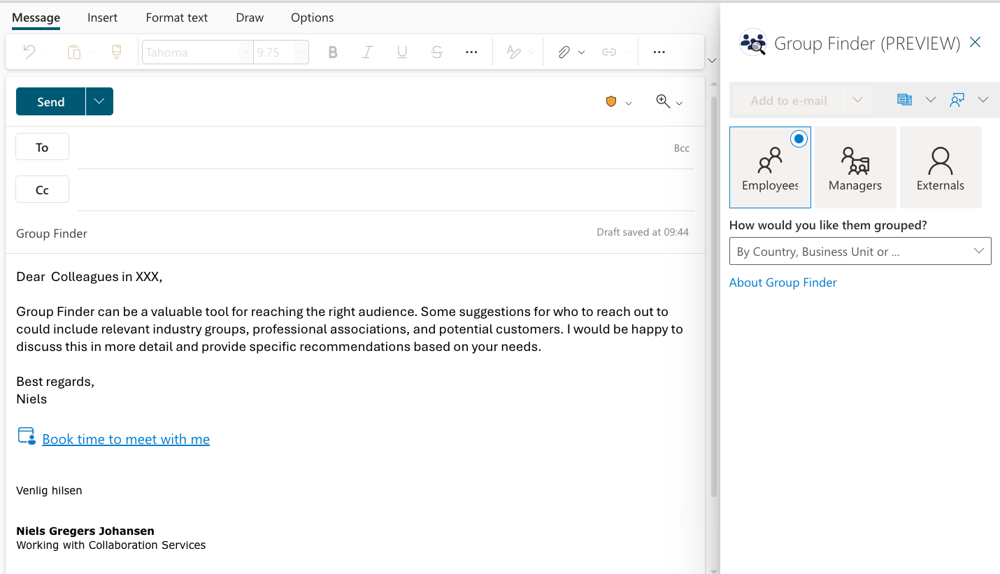
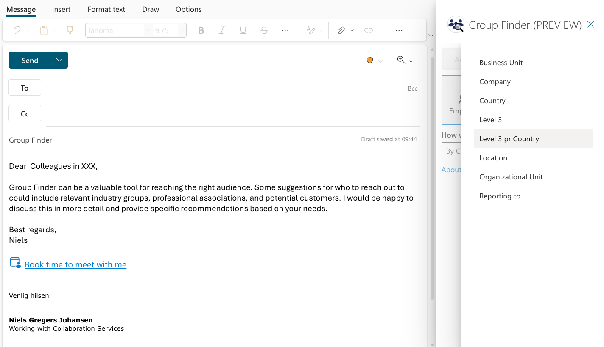
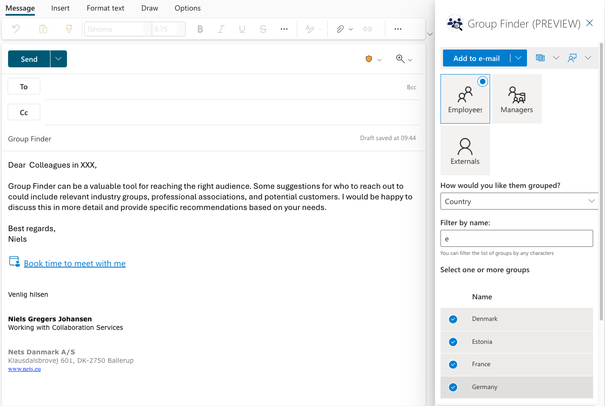
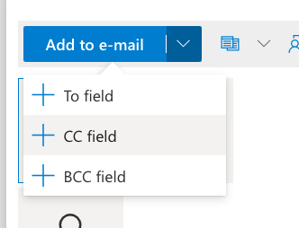
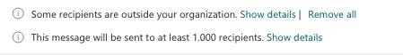
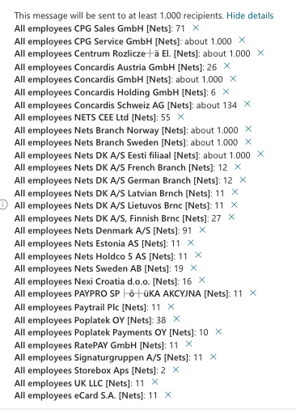

# Group Finder

Introducing Group Finder

Have you ever struggled to find the right people to include in your email or meeting invitation? Do you want to reach out to a specific group of employees or managers based on their business unit, level, location, team name, or reporting to? If so, you might want to try Group Finder, a new tool that can help you find relevant groups with ease.

You might have had problems with technical limitations in Outlook / Exchange preventing you from sending to more than a 1000 recipients in one mail. [See Microsoft documentation](https://learn.microsoft.com/en-us/office365/servicedescriptions/exchange-online-service-description/exchange-online-limits#receiving-and-sending-limits)

Use [Group Builder](../groupbuilder/) to bypass this limitation.

## What is Group Finder?

`Group Finder` is a tool that allows you to search for groups of people based on various criteria, such as:
•	Employee by business/group unit, level 3 to 9, location, team name or reporting to.
•	Manager by business/group unit, location, level 3 to 9.
•	Other criteria that you can specify.

`Group Finder` can help you save time and effort, as well as ensure that you don't miss anyone who should be included in your communication or collaboration.

## How to use Group Finder?

`Group Finder` is integrated into Outlook, so you can access it whenever you are preparing a new mail or meeting. Here are the steps to use `Group Finder`:
1.	Open a new mail or meeting window in Outlook.
2.	Click on the `Group Finder` icon in the ribbon.
3.	Select the criteria that you want to use to find the relevant groups.
4.	Review the results and select the groups that you want to add to the To, Cc, or Bcc fields.
5.	Click on OK to confirm your selection and close the `Group Finder` window.

That's it! You have successfully used `Group Finder` to find the relevant groups for your email or meeting. 

To learn more about Group Finder, use it and share you knowledge by extending this document.

## Authoring a new mail

