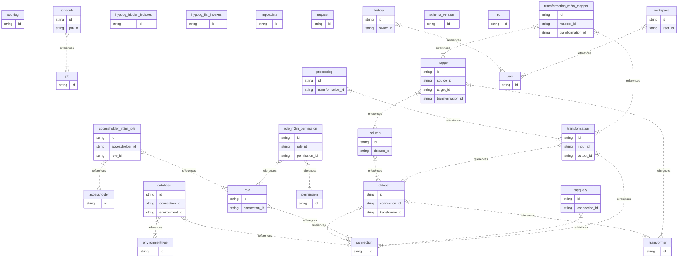

# Database Structure

This document provides an overview of the database structure, focusing on the relationships between tables, including parent-child relationships and the foreign keys used to establish these links.

## Table of Contents

- [Overview](#overview)
- [Table Relationships](#table-relationships)
  - [accessholder](#accessholder)
  - [accessholder_m2m_role](#accessholder_m2m_role)
  - [auditlog](#auditlog)
  - [column](#column)
  - [connection](#connection)
  - [database](#database)
  - [dataset](#dataset)
  - [environmenttype](#environmenttype)
  - [history](#history)
  - [hypopg_hidden_indexes](#hypopg_hidden_indexes)
  - [hypopg_list_indexes](#hypopg_list_indexes)
  - [importdata](#importdata)
  - [job](#job)
  - [mapper](#mapper)
  - [permission](#permission)
  - [processlog](#processlog)
  - [request](#request)
  - [role](#role)
  - [role_m2m_permission](#role_m2m_permission)
  - [schedule](#schedule)
  - [schema_version](#schema_version)
  - [sql](#sql)
  - [sqlquery](#sqlquery)
  - [transformation](#transformation)
  - [transformation_m2m_mapper](#transformation_m2m_mapper)
  - [transformer](#transformer)
  - [user](#user)
  - [workspace](#workspace)
- [Entity-Relationship Diagram (ERD)](#entity-relationship-diagram-erd)

## Overview

This database consists of several tables that store data related to roles, permissions, data transformations, scheduling, and other administrative functions. The relationships between these tables are primarily defined through foreign keys, which establish links between related records.

## Table Relationships

### accessholder

The `accessholder` table is an independent table with no direct parent or child relationships.

### accessholder_m2m_role

- **Child Table**: `accessholder_m2m_role`
- **Parent Table**: `accessholder`, `role`
- **Foreign Keys**:
  - `accessholder_id` references `accessholder.id`
  - `role_id` references `role.id`

This table defines a many-to-many relationship between `accessholder` and `role`.

### auditlog

The `auditlog` table is an independent table with no direct parent or child relationships.

### column

- **Child Table**: `column`
- **Parent Table**: `dataset`
- **Foreign Key**:
  - `dataset_id` references `dataset.id`

This table represents columns within a dataset.

### connection

The `connection` table is an independent table with no direct parent or child relationships.

### database

- **Child Table**: `database`
- **Parent Table**: `connection`, `environmenttype`
- **Foreign Keys**:
  - `connection_id` references `connection.id`
  - `environment_id` references `environmenttype.id`

This table represents databases and their connections.

### dataset

- **Child Table**: `dataset`
- **Parent Table**: `connection`, `transformer`
- **Foreign Keys**:
  - `connection_id` references `connection.id`
  - `transformer_id` references `transformer.id`

This table represents datasets linked to connections and transformers.

### environmenttype

The `environmenttype` table is an independent table with no direct parent or child relationships.

### history

- **Child Table**: `history`
- **Parent Table**: `user`
- **Foreign Key**:
  - `owner_id` references `user.id`

This table tracks history entries related to users.

### hypopg_hidden_indexes

The `hypopg_hidden_indexes` table is an independent table with no direct parent or child relationships.

### hypopg_list_indexes

The `hypopg_list_indexes` table is an independent table with no direct parent or child relationships.

### importdata

The `importdata` table is an independent table with no direct parent or child relationships.

### job

The `job` table is an independent table with no direct parent or child relationships.

### mapper

- **Child Table**: `mapper`
- **Parent Table**: `column`, `transformer`
- **Foreign Keys**:
  - `source_id` references `column.id`
  - `target_id` references `column.id`
  - `transformation_id` references `transformer.id`

This table defines mappings between columns and transformations.

### permission

The `permission` table is an independent table with no direct parent or child relationships.

### processlog

- **Child Table**: `processlog`
- **Parent Table**: `transformation`
- **Foreign Key**:
  - `transformation_id` references `transformation.id`

This table logs processes related to transformations.

### request

The `request` table is an independent table with no direct parent or child relationships.

### role

- **Child Table**: `role`
- **Parent Table**: `connection`
- **Foreign Key**:
  - `connection_id` references `connection.id`

This table defines roles associated with database connections.

### role_m2m_permission

- **Child Table**: `role_m2m_permission`
- **Parent Table**: `role`, `permission`
- **Foreign Keys**:
  - `role_id` references `role.id`
  - `permission_id` references `permission.id`

This table defines a many-to-many relationship between `role` and `permission`.

### schedule

- **Child Table**: `schedule`
- **Parent Table**: `job`
- **Foreign Key**:
  - `job_id` references `job.id`

This table manages job schedules.

### schema_version

The `schema_version` table is an independent table with no direct parent or child relationships.

### sql

The `sql` table is an independent table with no direct parent or child relationships.

### sqlquery

- **Child Table**: `sqlquery`
- **Parent Table**: `connection`
- **Foreign Key**:
  - `connection_id` references `connection.id`

This table represents SQL queries executed on connections.

### transformation

- **Child Table**: `transformation`
- **Parent Table**: `connection`, `dataset`
- **Foreign Keys**:
  - `input_id` references `connection.id`
  - `output_id` references `dataset.id`

This table defines transformations between input connections and output datasets.

### transformation_m2m_mapper

- **Child Table**: `transformation_m2m_mapper`
- **Parent Table**: `mapper`, `transformation`
- **Foreign Keys**:
  - `mapper_id` references `mapper.id`
  - `transformation_id` references `transformation.id`

This table defines a many-to-many relationship between `mapper` and `transformation`.

### transformer

The `transformer` table is an independent table with no direct parent or child relationships.

### user

The `user` table is an independent table with no direct parent or child relationships.

### workspace

- **Child Table**: `workspace`
- **Parent Table**: `user`
- **Foreign Key**:
  - `user_id` references `user.id`

This table represents workspaces assigned to users.
