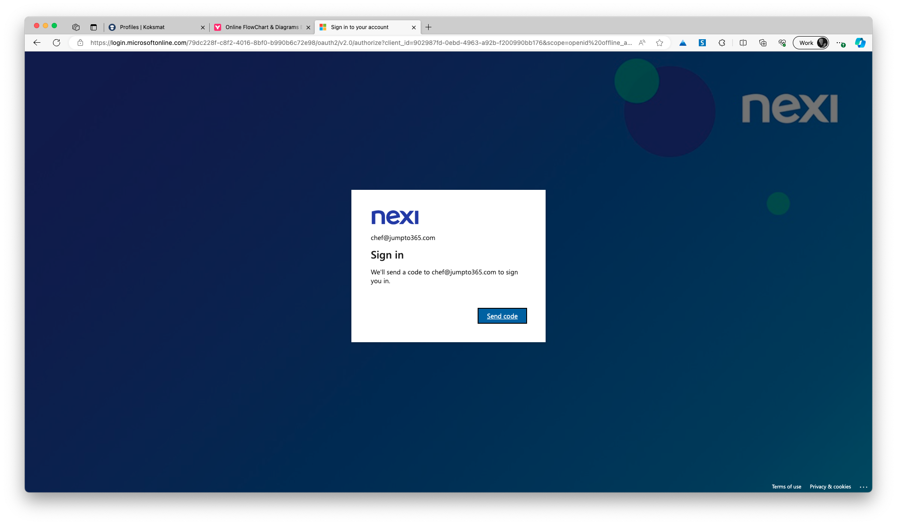
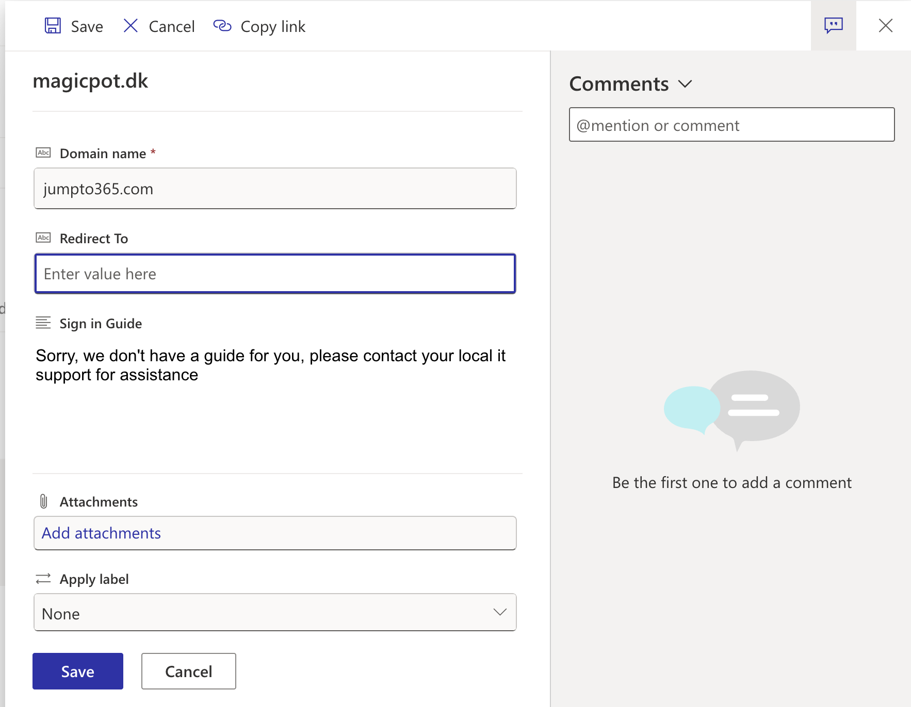
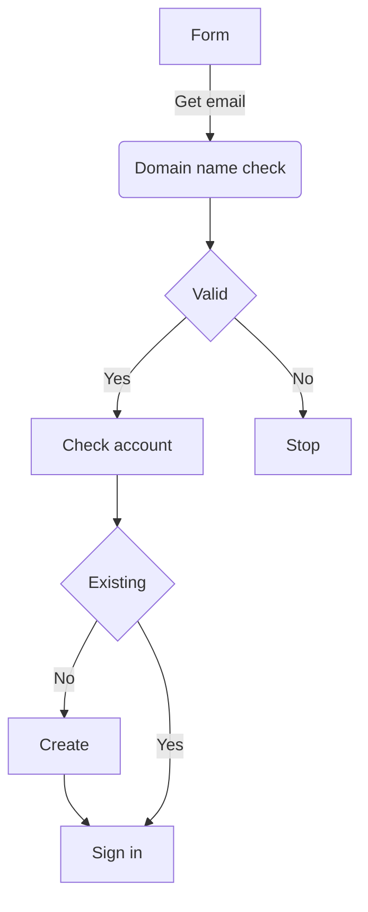

# Profiles 

Source https://github.com/koksmat-com/ui/tree/main/apps/www/app/profile

> We like to ensure that users without and existing account can be invited to the platform.

The Profiling App takes care of creating and maintaining user profiles for external users. 


## In/Output

| Area | Description |
| ----------- | ----------- |
| Input | Email address |
| Output | Guest account in Tenant (optional)|
| Output | Memberships of selected Microsoft 365 groups |

## Control Data

| Area | Storage |
| ----------- | ----------- |
| Domain Whitelist | SharePoint list |
| Groups to select from |  SharePoint list|


## User Experience

### First time visit

path: /profile

As a first time user, you will be able to get a profile by entering your email address and setting up your preferences.


```text
https://login.microsoftonline.com/79dc228f-c8f2-4016-8bf0-b990b6c72e98/oauth2/v2.0/authorize?client_id=902987fd-0ebd-4963-a92b-f200990bb176&scope=openid%20offline_access%20Directory.Read.All%20People.Read%20User.Read%20Sites.ReadWrite.All%20Directory.Read.All%20Calendars.ReadWrite&response_type=code&redirect_uri=https%3A%2F%2Fhome.nexi-intra.com%2Fapi%2Fauth%2Fcallback%2Fazure-ad&login_hint=chef%40jumpto365.com&state=GSTR2sAKPgmKWphA66p2pobW9TV3FetcyPAu2FaKerc
```



### Return visit


## Profiling page
| Entrypoint | Path |
| ----------- | ----------- |
| Navigate to current profile for signed user | /profile/route |


### Profile page


## Return to profle page

## Backend

### Whitelisted domains
 SharePoint list containing whitelist of domains


## Appendix

### Domain name check



