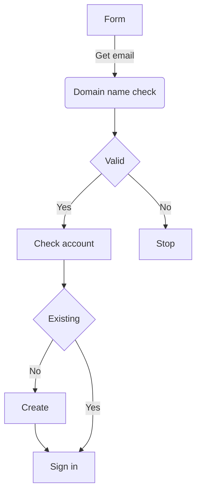

# Profiles

## Initial page

### First time
We like to ensure that users without and existing account can be invited to the platform.

https://login.microsoftonline.com/79dc228f-c8f2-4016-8bf0-b990b6c72e98/oauth2/v2.0/authorize?client_id=902987fd-0ebd-4963-a92b-f200990bb176&scope=openid%20offline_access%20Directory.Read.All%20People.Read%20User.Read%20Sites.ReadWrite.All%20Directory.Read.All%20Calendars.ReadWrite&response_type=code&redirect_uri=https%3A%2F%2Fhome.nexi-intra.com%2Fapi%2Fauth%2Fcallback%2Fazure-ad&login_hint=chef%40jumpto365.com&state=GSTR2sAKPgmKWphA66p2pobW9TV3FetcyPAu2FaKerc

### Second time

## Profiling page

## Return to profle page

## Backend

### Whitelisted domains
 SharePoint list containing whitelist of domains

