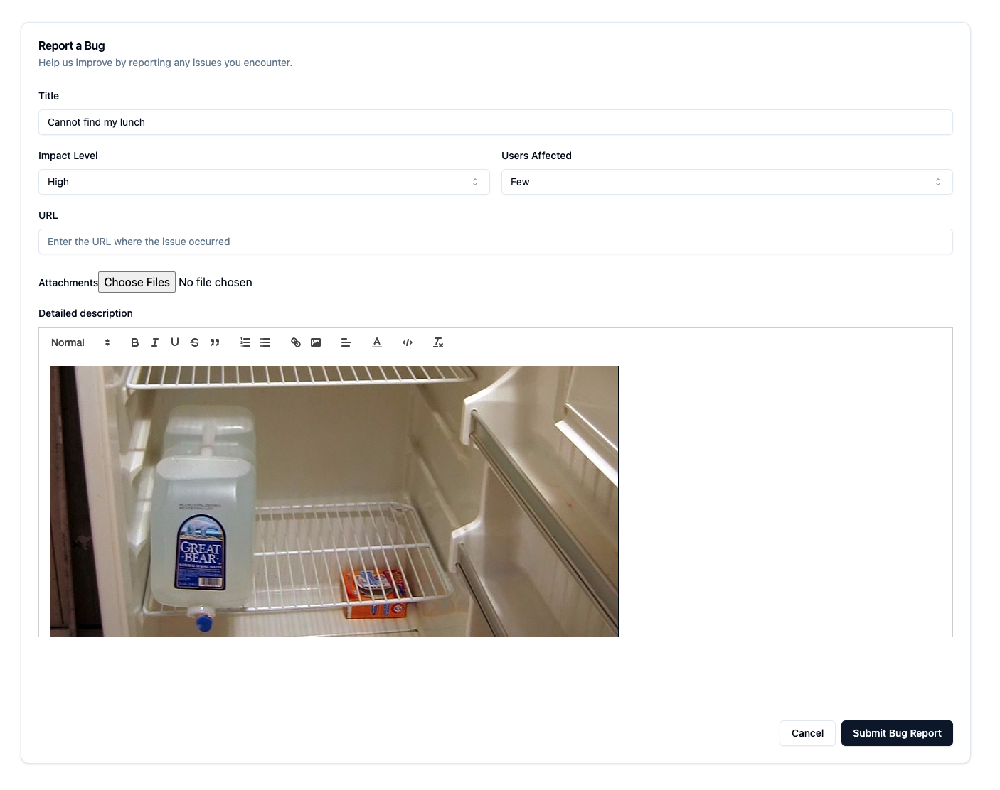

When working with any software, encountering bugs is inevitable. However, knowing how to report them effectively can save time, reduce frustration, and ultimately lead to faster resolutions. Here's a quick guide to ensure your bug reports are clear, concise, and actionable.

## Key Elements of a Bug Report

1. **Title**:  
   The title should be a brief summary of the issue. Avoid vague titles like "It's broken." Instead, use something descriptive like "Button does not respond when clicked on mobile."

2. **Impact Level**:  
   How severe is the bug? This helps prioritize the issue. Choose from options like _Low_, _Medium_, or _High_. In the example above, "Medium" is selected, indicating that the bug has a noticeable impact but isn't critical.

3. **Users Affected**:  
   Specify the number of users experiencing the issue. Is it a problem affecting everyone, or just a few? This helps in determining the urgency of the fix.

4. **URL**:  
   If applicable, provide the URL where the issue occurred. This is particularly important for web applications.

5. **Attachments**:  
   Visual evidence is invaluable. Screenshots, videos, or log files can help developers understand the issue better. Just like in the example, you can choose files that demonstrate the bug.

6. **Detailed Description**:  
   This is where you elaborate on the issue. Include steps to reproduce the bug, expected behavior, and what actually happened. The more details you provide, the easier it will be for the team to diagnose and fix the issue.

## Writing the Detailed Description

When writing the detailed description, be sure to include:

- **Steps to Reproduce**: Describe the exact steps to recreate the issue. The clearer you are, the better.
- **Expected Result**: What should have happened? This helps in identifying whether something is a bug or a misunderstood feature.
- **Actual Result**: What actually happened? Describe the discrepancy between expected and actual behavior.

## Conclusion

Effective bug reporting is a crucial skill, whether you're a developer, tester, or user. By providing clear, detailed, and accurate information, you can help ensure that issues are resolved quickly and efficiently. Remember, a well-reported bug is half-fixed!

If you encounter an issue, don't hesitate to report it using the guidelines above. Happy debugging!

- Try it: [Canary build](https://nexi-intra-report-defect-canary.intra.nexigroup.com/report-defect)
- Use it: [Docker file](https://github.com/nexi-intra/report-defect/pkgs/container/report-defect)
- Customise it: [GitHub](https://github.com/nexi-intra/report-defect)
