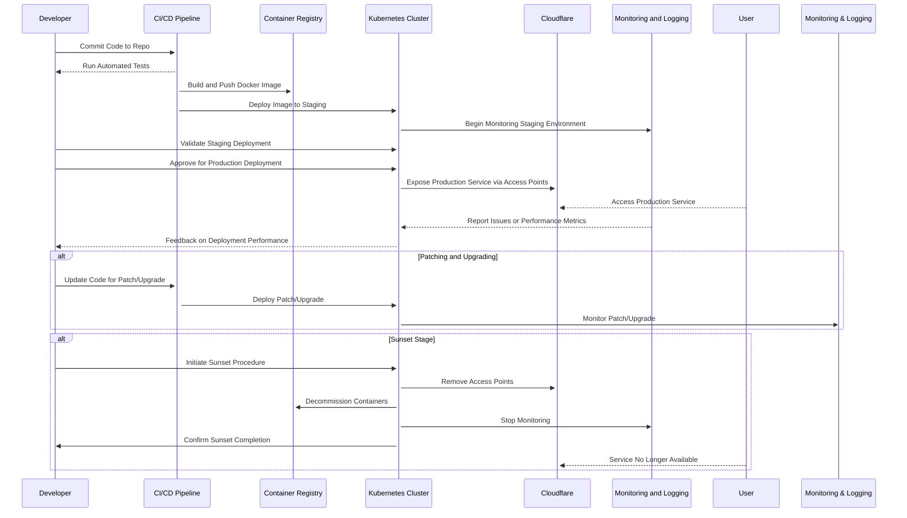

# CI/CD Workflow with Containers, Kubernetes, and Cloudflare

This sequence diagram outlines the workflow for organizing your work using CI/CD, containers, Kubernetes, and Cloudflare. It covers the entire lifecycle from initial drafting to production, including patching, upgrading, and eventual sunset. This approach ensures a streamlined process, enhancing efficiency, security, and scalability.

The sequence diagram you've provided outlines a comprehensive workflow for a DevOps pipeline involving multiple components such as a CI/CD pipeline, container registry, Kubernetes cluster, Cloudflare, and monitoring/logging tools. Below is a textual breakdown of the process:

### Main Workflow:

1. **Code Commit and Testing:**

   - **Developer** commits code to a repository.
   - The **CI/CD Pipeline** runs automated tests and reports the results back to the **Developer**.

2. **Build and Deploy:**

   - The **CI/CD Pipeline** builds a Docker image and pushes it to the **Container Registry**.
   - The **CI/CD Pipeline** then deploys this image to a staging environment in the **Kubernetes Cluster**.

3. **Staging Validation:**

   - The **Kubernetes Cluster** begins monitoring the staging environment via **Monitoring & Logging** tools.
   - The **Developer** validates the deployment in staging and approves it for production.

4. **Production Deployment:**
   - The **Kubernetes Cluster** deploys the application to the production environment and exposes the service through **Cloudflare** access points.
   - **End Users** access the production service via **Cloudflare**.
   - The **Monitoring & Logging** system reports any issues or performance metrics back to the **Kubernetes Cluster**, which then provides feedback to the **Developer**.

### Alternative Paths:

- **Patching and Upgrading:**

  - The **Developer** updates the code for a patch or upgrade.
  - The **CI/CD Pipeline** deploys the patch/upgrade to the **Kubernetes Cluster**.
  - The **Kubernetes Cluster** monitors the patch/upgrade process through the **Monitoring & Logging** tools.

- **Sunset Stage:**
  - The **Developer** initiates the sunset procedure for the application.
  - The **Kubernetes Cluster** removes access points from **Cloudflare**, decommissions containers from the **Container Registry**, stops monitoring, and confirms the completion of the sunset process with the **Developer**.
  - **End Users** find that the service is no longer available.

### Workflow Summary:

- The overall process ensures that code is thoroughly tested, deployed, monitored, and made available to end users with an option for patching/upgrading and sunsetting the application as needed.

This diagram is a robust representation of modern DevOps practices, demonstrating how various components interact in a typical continuous integration/continuous deployment pipeline.
