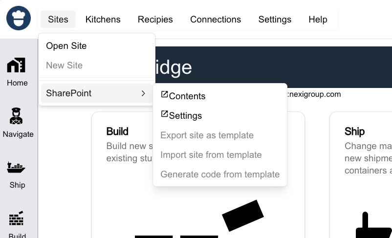
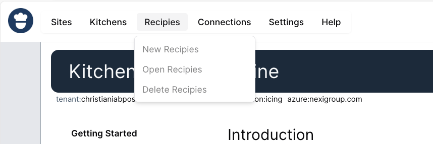
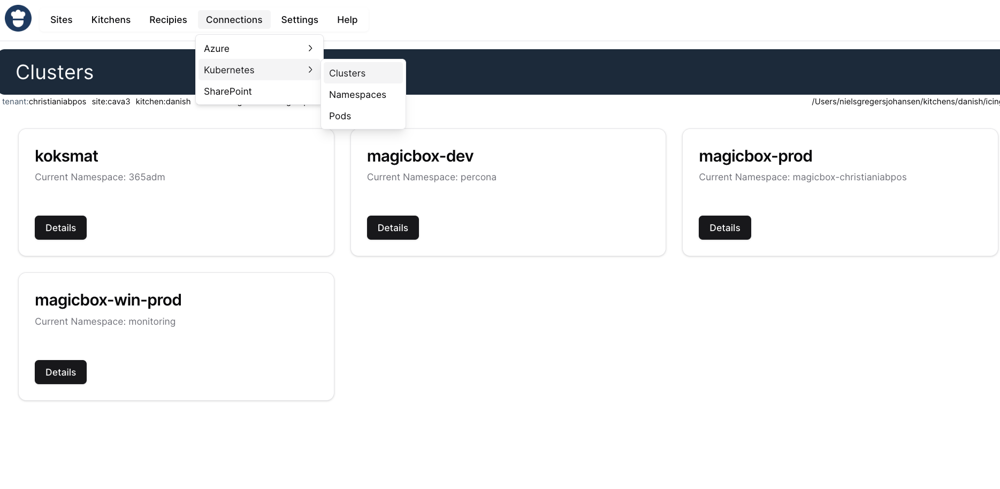

# Miller

Status: `draft`

## Synopsis
`Miller` is code name for the project which goal is to make a app which integrateds both UI and Workflow into a single document based application using a desired state approach. The app is defined in a single YAML file which is using the analogi to navigating a ship. Using terms list `port`,`position`, `heading`, `container`, `shipping`, `cargo` and `manifest` to describe the app.

Ambition is to make something which can end to be as powerfull as an US Aircraft Carrier, but as easy to use to get started with as sailing a small boat. `Miller` is a part of the name of the next US Aircraft Carrier - [CVN-81](https://en.wikipedia.org/wiki/USS_Doris_Miller) which will be name after Doris Miller - a hero from the attack on Pearl Harbor - working as a `Koksmat` - Naval Cook assistant.

## The Bridge


### Sites


### Kitchens


### Recipes


### Connections



## Navigator
A Headless workflow engine which is used to navigate the ship. The navigator is using a desired state approach to navigate the ship. The navigator is using a single YAML file to define the app. The navigator is using the analogi to navigating a ship. Using terms list `port`,`position`, `heading`, `container`, `shipping`, `cargo` and `manifest` to describe the app.

### Sample YAML

```yaml 
journey: v1
metadata:
  app: cava
  name: Meeting
  description: |
    This is the recipie for running a meeting. Each "instance"
    of this recipie is called a ship, and what is keeping everybody
    onboard are the Koksmat's which do all of the trivial work of
    making nice food and drinks for the crew and the passengers.
triggers:
  - trigger: null
    name: purpose
    key: purpose
    details:
      - title
      - description
waypoints:
  - port: Planning
    done:
      - invitation
    loads:
      containers:
        - container: null
          name: Prepare Meeting
          key: meeting:10.10
          who:
            - organizer
          approve:
            - chair
          consult:
            - speakers
          inform:
            - attendees
          needs:
            - purpose title description
          produces:
            - agenda-suggestion
            - time-suggestion .dateinterval
            - place-suggestion site building
          script: |
            write-host "Prepared agenda"
        - container: null
          name: Pre Settlement
          key: meeting:10.20
          who:
            - organizer
          needs:
            - attendees-proposed
            - time-suggestion .dateinterval
            - place-suggestion site building
            - purpose  title description
            - agenda-suggestion title description durationInMinutes presenter
              attendees
          produces:
            - time-agreed .dateinterval
            - place-agreed
            - agenda-agreed
            - attendees
          script: |
            write-host "Aggreed on time,place and agenda"    
        - container: null
          name: Settle Meeting
          key: meeting:10.30
          who:
            - organizer
          approve:
            - chair
          needs:
            - attendee-list
            - time-agreed
            - place-agreed
            - agenda-agreed
          produces:
            - agenda
            - time
            - place
          script: |
            write-host "Agenda approved"                     
        - container: null
          name: Prepare Invitation
          key: meeting:10.40
          who:
            - organizer
          approve:
            - chair
          needs:
            - attendees .person
            - agenda
            - time-suggestion .dateinterval
            - place
          produces:
            - resources-requirements
          script: |
            write-host "Resources being booked" 
        - container: null
          name: Resource Booking
          key: meeting:10.50
          who:
            - resourceowner
          needs:
            - resources-suggestion
            - time .dateinterval
            - place
          produces:
            - resources-booking
          script: >
            write-host "Resources being
            booked"                                   
        - container: null
          name: Invite
          key: meeting:10.60
          who:
            - organizer
          needs:
            - resource-requirements
            - resource-booking
            - organizer
            - attendees
            - agenda
            - time
            - place
          produces:
            - invitation
          script: |
            write-host "Invitation send"     
  - port: Acceptance
    loads:
      containers:
        - container: null
          name: RSVP
          key: meeting:20.10
          who:
            - attendees
          needs:
            - invitation
          produces:
            - rsvp
          script: |
            write-host "Invitation Received"                           
        - container: null
          name: Process RSVP
          key: meeting:20.20
          who:
            - organizer
          needs:
            - rsvps
          produces:
            - attendeestatues
          script: |
            write-host "RSVP Received"   
  - port: Service Ordering
    loads:
      containers:
        - container: null
          name: Service Ordering
          key: meeting:30.10
          who:
            - organizer
          needs:
            - rsvps
          produces:
            - serviceorder-request
          script: |
            write-host "Service Order Requested"                
  - port: Arrival
    loads:
      containers:
        - container: null
          name: Arrival
          key: meeting:30.10
          who:
            - attendees
          needs:
            - invitation
          produces:
            - rsvp
          script: |
            write-host "Arrival Received"               
        - container: null
          name: Registration
          key: meeting:30.20
          who:
            - reception
          needs:
            - attendee
          produces:
            - accessticket
          script: |
            write-host "Registration Received"    
  - port: Meet
    loads:
      containers:
        - container: null
          name: Meet
          key: meeting:40.10
          who:
            - attendees
          needs:
            - accessticket
          produces:
            - rsvp
          script: |
            write-host "Meet Received"             
        - container: null
          name: Welcome
          key: meeting:40.10
          who:
            - chair
          needs:
            - agendaitems
          produces:
            - baton
          script: |
            write-host "Meet Received"             
        - container: null
          name: Present
          key: meeting:40.10
          who:
            - presenters
          needs:
            - baton
            - agendaitem
          produces:
            - decision
          script: |
            write-host "Meet Received"  
  - port: Departure
    loads:
      containers:
        - container: null
          name: Departure
          key: meeting:50.10
          who:
            - attendees
          needs:
            - invitation
          produces:
            - rsvp
          script: |
            write-host "Departure Received"             
  - port: Resource services
    loads:
      containers:
        - container: null
          name: Resource Booking
          key: meeting:60.10
          who:
            - organizer
            - resourceowner
          needs:
            - resources-suggestion
            - time
            - place
          produces:
            - resources-booking
          script: |
            write-host "Resources being booked"
  - port: Catering Services
    services:
      - tugs:
          - tug: null
            name: Change to meeting
            who:
              - attendees
            needs:
              - invitation
              - time
            produces:
              - serviceorder-change
              - resources-suggestion
            script: |
              write-host "Change monitoring"
    loads:
      containers:
        - container: null
          name: Approval
          key: meeting:70.10
          who:
            - dispatcher
          needs:
            - serviceorder-request
          produces:
            - serviceorder-approved
          script: |
            write-host "Back Office Received"                
        - container: null
          name: Production
          key: meeting:70.20
          who:
            - serviceprovider
          needs:
            - serviceorder-approved
          produces:
            - serviceorder
          script: |
            write-host "Service produced"                
        - container: null
          name: Delivery
          key: meeting:70.30
          who:
            - serviceprovider
          needs:
            - serviceorder
          produces:
            - invoice-suggestion
          script: |
            write-host "Service delivered"                
        - container: null
          name: Invoicing
          key: meeting:70.40
          who:
            - finance
          needs:
            - invoice-suggestion
          produces:
            - invoice
          script: |
            write-host "Invoice produced"         
        - container: null
          name: Service Order Payment
          key: meeting:70.50
          who:
            - organizer
          needs:
            - invoice
          produces:
            - payment
          script: |
            write-host "Payment send"       

```