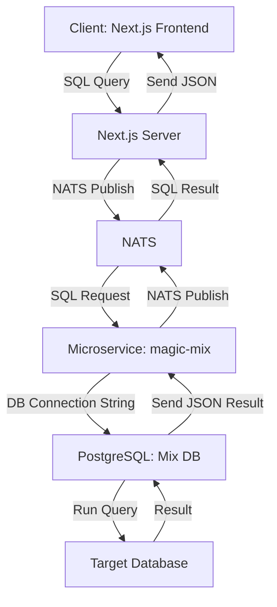
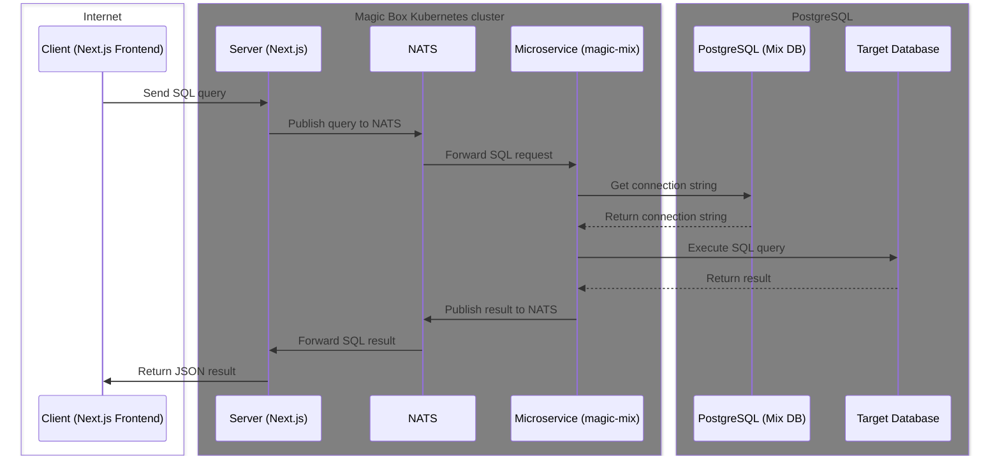
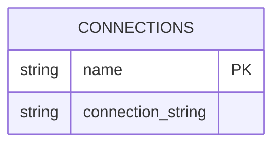

# Database Operations in the System

This document outlines how the Next.js web application interacts with the database using NATS and a microservice called `magic-mix`. The architecture supports defining SQL queries in the frontend, routing through NATS, and dynamically connecting to different databases.

## System Architecture Overview

The system is composed of several components that interact to perform database operations. Below is a high-level architecture view.

### Components

- **Client (Next.js Frontend)**: Defines SQL queries in pure SQL and sends them to the server.
- **Server (Next.js Server)**: Receives the SQL query from the frontend and publishes the request into a NATS subject.
- **NATS**: Message broker that forwards the SQL request to the microservice.
- **Microservice (magic-mix)**: Handles the request, establishes a database connection based on the requested database, executes the SQL query, and sends the result back.
- **PostgreSQL (Mix DB)**: Contains a `connections` table used to map database names to connection strings.
- **Target Database**: The database that the SQL query is executed against.

## Sequence of Operations

The following diagram details the flow of a SQL query from the frontend to the database and back to the frontend.

### Frontend Query Definition

The frontend allows users to define SQL queries directly in pure SQL. These queries are passed to the server, which routes them into the system.

### NATS Message Handling

The server publishes the SQL query, along with metadata like the actor token and database name, into a NATS subject. NATS is responsible for routing this message to the correct microservice.

### Microservice Processing

The `magic-mix` microservice handles the request by looking up the database connection information in the `connections` table of the `mix` PostgreSQL database. It then establishes a connection to the target database, executes the SQL query, and transforms the result into JSON format.

### Database Connection

The `mix` PostgreSQL database has a `connections` table structured as follows:

- `name`: The name of the database.
- `connection_string`: The connection string for the respective database.

The microservice uses this information to connect to the correct database, run the query, and return the results.

## Database Connectivity

The `magic-mix` service dynamically connects to different databases based on the query request. The PostgreSQL `mix` database holds information about various target databases through its `connections` table. The microservice retrieves the appropriate connection string and establishes a connection.

- **Name**: The name of the database.
- **Connection String**: The corresponding connection string used to connect to the database.

---

This concludes the overview of how database operations are made in the system.
