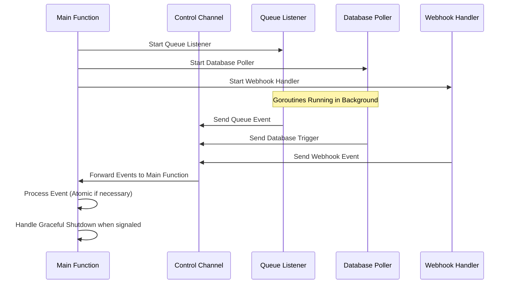

# Koksmat workflow controller Boot and Lifecycle

This document describes the boot sequence and lifecycle of the Koksmat workflow controller that orchestrates Goroutines for queue management, database polling, and webhook handling. It details the startup process, the flow of events through the control channel, and how the service handles shutdowns gracefully.

## Boot Sequence

The boot sequence for the Go service controller involves initializing Goroutines for different parts of the system and preparing the main function to handle control events.

### 1. Start Main Function

The service begins by launching the **Main Function**, which is responsible for:

- Starting and managing Goroutines that handle specific tasks.
- Listening on the **Control Channel** to process events that are generated by the Goroutines.
- Monitoring signals for graceful shutdown.

### 2. Start Goroutines

The main function starts three key Goroutines that handle specific responsibilities:

- **Queue Listener**: Responsible for listening to a message queue (such as RabbitMQ or Kafka) and sending events to the control channel.
- **Database Poller**: Polls the database at regular intervals, checking for triggers or other conditions, and sending corresponding events to the control channel.
- **Webhook Handler**: Exposes an HTTP endpoint to receive external requests (e.g., webhook notifications) and sends those events to the control channel.

These Goroutines run in the background, independently generating events as they process their respective inputs.

## Lifecycle of the Controller

Once the controller is booted, the following lifecycle steps occur as the system operates:

### 1. Event Generation by Goroutines

Each Goroutine is responsible for monitoring its own inputs and generating events:

- **Queue Listener**: Generates a **Queue Event** when a message is received from the queue.
- **Database Poller**: Generates a **Database Trigger** when a condition or event is found during polling.
- **Webhook Handler**: Generates a **Webhook Event** when an HTTP request is received.

These events are pushed to the **Control Channel** for processing by the main function.

### 2. Event Handling in Main Function

The **Main Function** listens to the control channel for incoming events:

- Once an event is received, it processes the event according to its type (queue, database, webhook).
- If necessary, the event is handled atomically to ensure that critical sections of the code are protected from race conditions.

For events that require atomic execution, the main function uses synchronization mechanisms like mutexes or atomic operations to ensure that only one event is processed at a time.

### 3. Graceful Shutdown

When a signal for shutdown is received (e.g., `SIGINT` or `SIGTERM`), the service needs to stop gracefully:

- The **Main Function** stops accepting new events and starts the shutdown process.
- It sends a signal to each Goroutine (queue listener, database poller, and webhook handler) to stop and finish their current tasks.
- The service waits for all Goroutines to finish their work before fully shutting down. This ensures that no events or messages are lost during the shutdown process.

## Control Flow and Atomic Operations

The control flow is handled centrally in the **Main Function**, which processes all events passed through the control channel. Some events may require atomic processing to avoid race conditions, especially if multiple Goroutines try to update shared resources.

- **Atomic Operations**: Go provides the `sync/atomic` package for simple atomic operations (like counters), but for more complex operations, a `sync.Mutex` can be used to protect critical sections.
- **Mutex Usage**: If an event needs to be executed atomically, the main function locks the mutex, processes the event, and then unlocks it.

## Key Components

### 1. Control Channel

The **Control Channel** is the key communication mechanism between the main function and the Goroutines. Each Goroutine generates events and pushes them to this channel, where the main function listens and processes them sequentially.

### 2. Goroutines

The Goroutines in this service perform specific tasks that contribute to the overall functionality of the service:

- **Queue Listener**: Listens to external message queues and generates events when messages are received.
- **Database Poller**: Polls a database for triggers and generates events when conditions are met.
- **Webhook Handler**: Exposes an HTTP API to receive external requests (e.g., webhooks) and generates events when requests are received.

### 3. Graceful Shutdown

Handling graceful shutdown is crucial for long-running services. The main function ensures that when a shutdown signal is received:

- New events are not accepted.
- Goroutines are allowed to finish their work.
- All resources (like database connections and network listeners) are closed properly.

## Summary

The boot sequence and lifecycle of this Go service controller are centered around starting Goroutines, handling events via the control channel, and ensuring atomic event processing when necessary. The controller also gracefully handles shutdown signals, ensuring that no work is lost and resources are cleaned up properly.

This architecture allows for scalable event-driven services, capable of handling long-running tasks, while ensuring safety and proper resource management.
