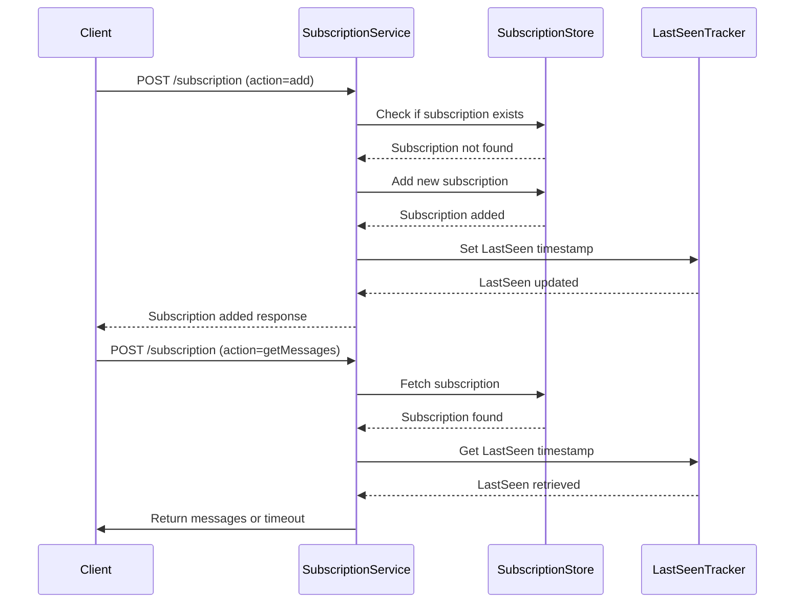

# Subscription Management Service

This document provides an overview of the internal workings of the Subscription Management Service, including details about the web interfaces it provides for managing subscriptions.

## Overview

The Subscription Management Service handles the lifecycle of client subscriptions, providing key functionality such as:

- Adding new subscriptions
- Removing existing subscriptions
- Updating subscription metadata (e.g., last seen timestamp)
- Fetching messages with a timeout
- Automatically managing TTL (time-to-live) to clean up expired subscriptions

### Components

The service consists of the following key components:

1. **Subscription**: Represents the subscription object containing an ID and other metadata.
2. **SubscriptionStore**: Interface that abstracts storage operations for subscriptions.
3. **LastSeenTracker**: Manages the last-seen timestamps for each subscription.
4. **TTLManager**: Manages the automatic removal of subscriptions that have expired.
5. **Message Fetching**: Allows fetching new messages with a timeout.

### Sequence Diagram

Below is a sequence diagram illustrating the interaction between different components during the `Add Subscription` and `Get Messages` processes.



### Internals

The service works as a long-running process that continuously manages subscriptions based on the following flows:

#### 1. **Add Subscription**

When a client requests to add a subscription, the service performs the following steps:

- Checks if the subscription already exists in the `SubscriptionStore`.
- If the subscription does not exist, it is added to the store.
- The `LastSeenTracker` is updated to track the last-seen timestamp for the new subscription.

#### 2. **Remove Subscription**

When a client requests to remove a subscription:

- The service retrieves the subscription by ID from the `SubscriptionStore`.
- If found, the subscription is removed from the store.

#### 3. **Update Subscription**

Updating a subscription typically involves refreshing the last-seen timestamp. The service:

- Retrieves the subscription by ID from the `SubscriptionStore`.
- Updates the `LastSeenTracker` to the current time.

#### 4. **List Subscriptions**

The service can list all subscriptions currently stored in the `SubscriptionStore`. This is useful for debugging and monitoring purposes.

#### 5. **Get Messages**

When a client requests new messages for a subscription, the service:

- Fetches the subscription by ID from the `SubscriptionStore`.
- Checks for new messages related to the subscription.
- If no messages are found, it waits for a specified timeout period before returning.

#### 6. **TTL Monitoring**

The service includes a background task that continuously checks for subscriptions that have exceeded their TTL. The `TTLManager` handles this by:

- Iterating through all subscriptions.
- Checking if their last-seen timestamp exceeds the defined TTL.
- Removing expired subscriptions from the store.

## Web Interfaces

The following web interfaces are exposed by the Subscription Management Service:

### 1. **Add Subscription**

**Endpoint:** `POST /api/workflow/subscription`  
**Action:** `add`

**Request Payload:**

```json
{
  "action": "add",
  "id": "subscription_id"
}
```

**Response:**

```json
{
  "status": "added"
}
```

### 2. **Remove Subscription**

**Endpoint:** `POST /api/workflow/subscription`  
**Action:** `remove`

**Request Payload:**

```json
{
  "action": "remove",
  "id": "subscription_id"
}
```

**Response:**

```json
{
  "status": "removed"
}
```

### 3. **Update Subscription**

**Endpoint:** `POST /api/workflow/subscription`  
**Action:** `update`

**Request Payload:**

```json
{
  "action": "update",
  "id": "subscription_id"
}
```

**Response:**

```json
{
  "status": "updated"
}
```

### 4. **List Subscriptions**

**Endpoint:** `POST /api/workflow/subscription`  
**Action:** `list`

**Request Payload:**

```json
{
  "action": "list"
}
```

**Response:**

```json
[
  {
    "id": "subscription_id_1"
  },
  {
    "id": "subscription_id_2"
  }
]
```

### 5. **Get Messages**

**Endpoint:** `POST /api/workflow/subscription`  
**Action:** `getMessages`

**Request Payload:**

```json
{
  "action": "getMessages",
  "id": "subscription_id",
  "timeout": 5
}
```

**Response:**

```json
{
  "status": "success",
  "messages": ["message1", "message2"]
}
```

**Timeout Response:**

```json
{
  "status": "timeout",
  "messages": []
}
```

## Conclusion

The Subscription Management Service is designed to be a robust and extensible system for managing client subscriptions. It includes built-in mechanisms for handling TTL expiration, ensuring that stale subscriptions are removed automatically. The web interfaces provide easy integration for clients to manage their subscriptions and retrieve messages in real-time.
