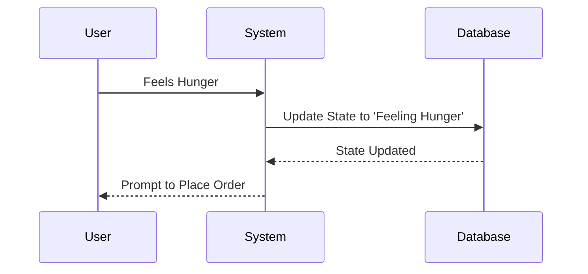
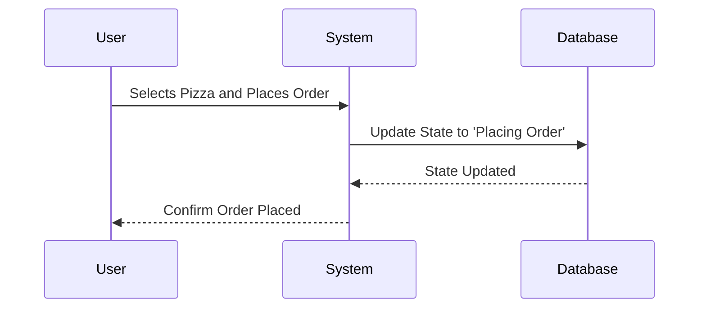
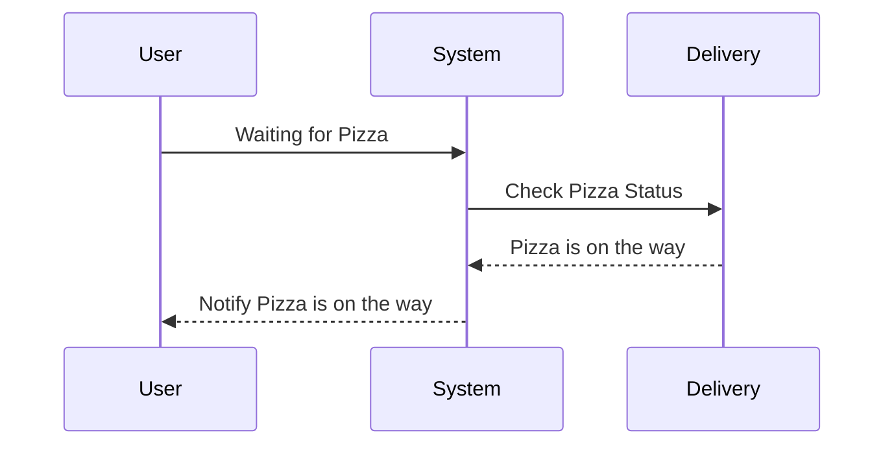
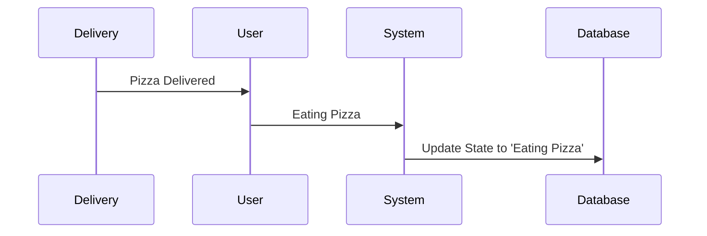
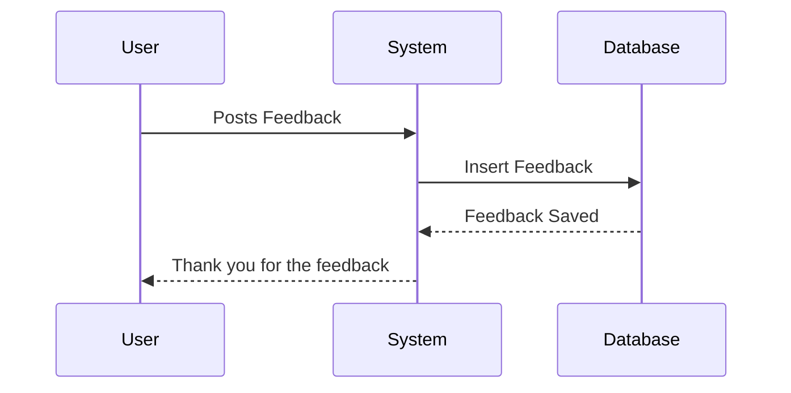

# Workflow System: Ordering a Pizza

This article demonstrates a simple workflow system using the case of ordering a pizza. The process is split into five stages:

1. **Feeling Hunger**
2. **Placing an Order**
3. **Waiting for the Pizza**
4. **Eating the Pizza**
5. **Posting Feedback**

The example showcases how each stage is represented in the system, the underlying SQL statements, and how the user interface reflects the current stage. We will also explore how to extend this workflow.

---

## 1. Feeling Hunger

In this stage, the system detects that the user is hungry. This is triggered by the user input, which updates the workflow's state.

### SQL Statement

```sql
SELECT proc.create_session(
	'niels',
	 '{
        "tenant":"",
        "searchindex":"",
        "name":"niels",
        "user_id":8,
        "data":"{}"
     }'
)
```

```js
{
  "id": "pizza_order",
  "name": "Pizza Order Process 2",
  "stage": [
    {
      "id": "hunger_phase",
      "name": "Feeling Hunger",
      "raci": {
        "informed": "Audit Log",
        "consulted": "Webshop",
        "responsible": "system"
      },
      "actions": [
        {
          "id": "register_hunger",
          "ui": "https://hunger.intra.nexigroup.com",
          "icon": "alert-circle",
          "name": "Register Hunger",
          "description": "Recognize that you are hungry and decide to order a pizza.",
          "interactive": true,
          "transaction": "{ \"service\": \"order\",\n  \"transactions\" : [\n    {\n      \"order_id\": \"${order_id}\",\n      \"status\": \"posted\"\n    }\n  ]\n}\n"
        },
        {
          "id": "post_order",
          "ui": "https://hunger.intra.nexigroup.com/aoi/shiporder",
          "sql": "select * from order where reference =${order_id} and  status ->> 'paid' is null status ->> 'posted' is  null",
          "icon": "ship",
          "name": "Post Order",
          "description": "Submit your pizza order to the restaurant.",
          "interactive": false
        }
      ],
      "triggers": {
        "actions": [
          {
            "id": "hunger",
            "sql": "select * from hunger from state is null",
            "name": "Hunger",
            "description": "The feeling of hunger."
          }
        ]
      },
      "decisions": [
        {
          "id": "decide_next",
          "icon": "more-horizontal",
          "name": "Decide Next Action",
          "description": "Decide what to do next after eating the pizza."
        }
      ]
    },
    {
      "id": "place_order_phase",
      "name": "Place Order",
      "raci": {
        "informed": "Audit Log",
        "consulted": "Webshop",
        "responsible": "User"
      },
      "actions": [
        {
          "id": "paid_order",
          "ui": "https://hunger.intra.nexigroup.com/pay/${order_id}",
          "icon": "credit-card",
          "name": "Pay Order",
          "description": "Pay for your pizza order.",
          "interactive": true
        },
        {
          "id": "order_confirmed",
          "ui": "https://hunger.intra.nexigroup.com/confirm/${order_id}",
          "sql": "select * from order where reference =${order_id} and status ->> 'paid' is not null",
          "icon": "check-square",
          "name": "Order Confirmed",
          "description": "Your order has been confirmed by the restaurant.",
          "interactive": false
        }
      ]
    },
    {
      "id": "waiting_phase",
      "name": "Waiting for Pizza",
      "raci": {
        "informed": "User",
        "responsible": "Delivery Person"
      },
      "actions": [
        {
          "id": "track_delivery",
          "ui": "https://hunger.intra.nexigroup.com/track/${order_id}",
          "icon": "truck",
          "name": "Track Delivery",
          "description": "Track the delivery of the pizza using the app.",
          "interactive": true
        },
        {
          "id": "receive_pizza",
          "ui": "https://hunger.intra.nexigroup.com/aoi/receivepizza",
          "icon": "box",
          "name": "Receive Pizza",
          "description": "Get the pizza from the delivery person.",
          "interactive": false
        }
      ]
    },
    {
      "id": "eating_phase",
      "name": "Eating Pizza",
      "actions": [
        {
          "id": "eat_pizza",
          "ui": "https://hunger.intra.nexigroup.com/eat/${order_id}",
          "icon": "utensils",
          "name": "Eat Pizza",
          "description": "Enjoy your pizza.",
          "interactive": true
        }
      ]
    },
    {
      "id": "feedback_phase",
      "name": "Post Feedback",
      "actions": [
        {
          "id": "post_feedback",
          "ui": "https://hunger.intra.nexigroup.com/feedback/${order_id}",
          "icon": "utensils",
          "name": "Post Feedback",
          "description": "Share your experience about the pizza and delivery.",
          "interactive": true
        }
      ]
    }
  ],
  "actors": {
    "app": {
      "name": "App",
      "description": "The Wolt app."
    },
    "shop": {
      "name": "Webshop",
      "description": "The webshop where the user orders the pizza."
    },
    "user": {
      "name": "User",
      "description": "A person who interacts with the system."
    },
    "system": {
      "name": "System",
      "description": "The system"
    },
    "auditlog": {
      "name": "Audit Log",
      "description": "The audit log."
    },
    "restaurant": {
      "name": "Restaurant",
      "description": "The restaurant preparing the pizza."
    },
    "delivery_person": {
      "name": "Delivery Person",
      "description": "The person delivering the pizza."
    }
  },
  "purpose": "Like to be full and happy.",
  "version": 1,
  "description": "Support a user in satisfying their hunger by ordering a pizza."
}
```

### Explanation

The system tracks the user's current stage of the workflow in the `workflow_state` table. This entry represents the start of the process.

### Mermaid Sequence Diagram



---

## 2. Placing an Order

Once the user feels hungry, they can place an order for a pizza.

### SQL Statement

```sql
UPDATE workflow_state
SET current_stage = 'Placing Order', timestamp = NOW()
WHERE user_id = 1;
```

### Explanation

This query updates the user's current stage to "Placing Order". The system prompts the user to select the pizza type and confirm the order.

### Mermaid Sequence Diagram



---

## 3. Waiting for the Pizza

After placing the order, the user enters the "Waiting for Pizza" stage. The system tracks the order's progress and informs the user.

### SQL Statement

```sql
UPDATE workflow_state
SET current_stage = 'Waiting for Pizza', timestamp = NOW()
WHERE user_id = 1;
```

### Explanation

The system now monitors the order status (e.g., baking, out for delivery) and informs the user of the estimated delivery time.

### Mermaid Sequence Diagram



---

## 4. Eating the Pizza

The pizza arrives, and the user starts eating.

### SQL Statement

```sql
UPDATE workflow_state
SET current_stage = 'Eating Pizza', timestamp = NOW()
WHERE user_id = 1;
```

### Explanation

This stage updates the user's status to "Eating Pizza", signaling that the pizza has arrived and the workflow is nearing completion.

### Mermaid Sequence Diagram



---

## 5. Posting Feedback

After eating the pizza, the user can post feedback on the experience.

### SQL Statement

```sql
INSERT INTO feedback (user_id, feedback, timestamp)
VALUES (1, 'Delicious pizza!', NOW());
```

### Explanation

In this final stage, the user provides feedback, and the system logs it in a `feedback` table. The workflow is now complete, and the system resets or extends the workflow for future orders.

### Mermaid Sequence Diagram



---

## User Interface Reflections

Each stage is reflected in the user interface. Below is a table illustrating the stages and the corresponding UI actions.

| Stage             | UI Element            | Action                                               |
| ----------------- | --------------------- | ---------------------------------------------------- |
| Feeling Hunger    | Prompt to Place Order | Display button for placing an order                  |
| Placing an Order  | Order Form            | Allow user to select pizza type and confirm order    |
| Waiting for Pizza | Status Tracker        | Display order progress and estimated delivery time   |
| Eating the Pizza  | Feedback Prompt       | Show prompt asking if the user is enjoying the pizza |
| Posting Feedback  | Feedback Form         | Display feedback form and thank you message          |

---

## Extending the Workflow

This system is flexible and can be extended in several ways, such as:

- Adding additional stages (e.g., receiving a discount coupon).
- Integrating real-time tracking with third-party APIs.
- Handling workflow interruptions (e.g., order canceled or delayed).

SQL statements for extending the workflow:

```sql
ALTER TABLE workflow_state ADD COLUMN is_extended BOOLEAN DEFAULT FALSE;

UPDATE workflow_state
SET is_extended = TRUE, current_stage = 'Received Coupon', timestamp = NOW()
WHERE user_id = 1;
```

With these extensions, the workflow can evolve based on user behavior or external factors.

---

## Conclusion

This simple workflow of ordering a pizza demonstrates how a workflow system can be structured and extended. With clear stages, SQL-backed data updates, and interactive UI elements, this system can be adapted for various real-world applications.

````

This markdown structure combines the stages, SQL actions, Mermaid diagrams, and UI considerations, making it an illustrative case for the workflow system. Let me know if you'd like to tweak anything further!
---
title: Pizza Order
---
#

## Register flow hook

```sql

````

## Create a new order

```sql
SELECT proc.create_pizzaorder(
	'niels',
	 '{
        "tenant":"",
        "searchindex":"",
        "name":"niels",
        "status":"",
        "size":""
     }'
)
```

```sql
SELECT proc.create_koksmat(
	'niels',
	 '{
        "tenant":"",
        "searchindex":"",
        "name":"auditlog flow",
        "data": {
          "flow": "auditlog",
          "type": "recipe",
          "table": "auditlog"
        }
     }'
)
```
