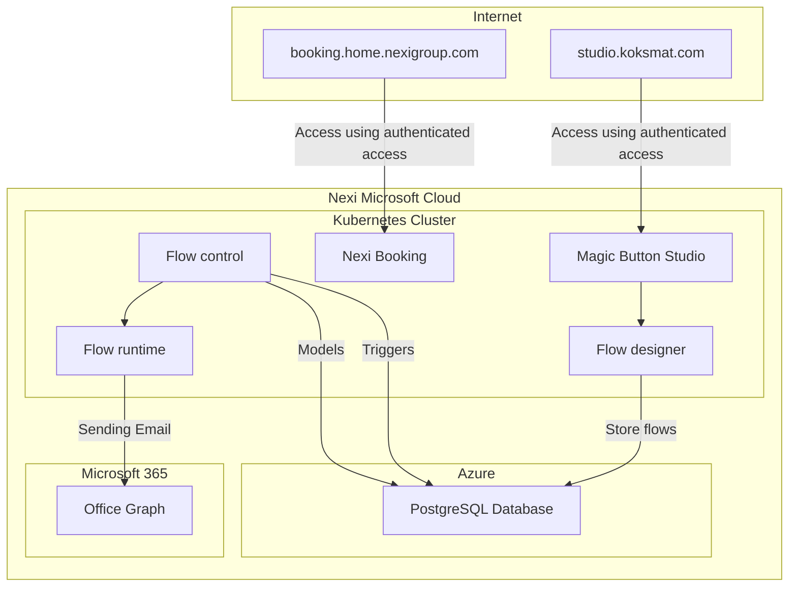

# Understanding the Platform Architecture

In this article, we'll break down the architecture of the platform using a visual aid provided by a **Mermaid diagram**. This diagram illustrates the flow of interactions between various components in the system, including external users, cloud services, and Kubernetes resources. By the end, you’ll have a deeper understanding of how the cloud infrastructure works.

## Mermaid Diagram Overview

Here is the full Mermaid diagram that depicts the platform architecture:



Let's dive into the individual components of this diagram and their roles within the system.

## 1. **External Users**: Access Points for Different User Types

- **User (booking.home.nexigroup.com)**: External users, such as customers or end users, access the Nexi Booking system via the public internet. This component represents the web-based booking service that users interact with for managing appointments or reservations.
- **Editor (Editor accessing Magic Button Studio)**: Editors and administrators working within the organization access Magic Button Studio via the intranet. These users have additional permissions and responsibilities to design and manage workflows within the Koksmat platform.

### Key Takeaway:

- External users and editors interact with different parts of the Nexi system through authenticated access, either from the internet or the intranet.

## 2. **Nexi Platform Boundary**: The Cloud Ecosystem

The **Nexi Platform Boundary** represents the core infrastructure of the platform, hosted in the **Nexi Microsoft Cloud**. It is composed of three key areas: the **Kubernetes Cluster**, **Azure**, and **Microsoft 365**.

### 2.1 **Kubernetes Cluster**

This is where most of the platform’s microservices reside, ensuring scalability and high availability. Let’s look at each of the services running in this cluster:

- **Magic Button Studio (Web Magic Studio)**: This is the interface for the editors to design workflows and configure automation. Editors interact with this component to manage system behavior and processes.
- **Nexi Booking**: The booking service accessed by external users. It interacts with other components to handle reservations and user data.
- **Workflow Designer (Flow Designer)**: This tool is where editors can create and manage workflows. Workflows define the automated sequences or processes that the system will execute.
- **NATS Store & NATS Messaging**: These are the messaging and event-handling services. **NATS Messaging** facilitates real-time communication between different microservices, while **NATS Store** ensures that events are saved and can be replayed or recovered.

- **Workflow Runtime (Flow Runtime)**: Once a workflow is designed, it is executed by the **Workflow Runtime**. This component manages the real-time execution of the defined flows.

- **Workflow Controller (Flow Control)**: The **Workflow Controller** is responsible for managing and orchestrating the flows. It ensures that workflows are triggered at the right time and coordinates with the **PostgreSQL Database** for storing triggers and models.

### 2.2 **Azure**: Data Storage with PostgreSQL

- **PostgreSQL Database**: All data related to workflows—such as triggers, stored models, and flow designs—are stored here. PostgreSQL acts as the primary database for the platform, ensuring reliable and secure storage for workflow configurations and user data.

### 2.3 **Microsoft 365**: Integration with Office Graph

- **Office Graph**: For workflows that involve communication (e.g., sending emails), Nexi integrates with **Microsoft 365** via the **Office Graph** API. The **Workflow Runtime** can trigger these actions, such as sending automated emails to users based on specific workflows.

### Key Takeaway:

- The platform is powered by cloud-based infrastructure, with microservices running in Kubernetes for scalability, a PostgreSQL database for secure data storage, and Office Graph for email communication.

## 3. **Flow of Data and Actions in the System**

Now, let's break down how data flows between the components:

1. **User Interaction with Nexi Booking**: External users access **Nexi Booking** through an authenticated web interface. This interaction starts the process where booking data can be stored or further processed.
2. **Editor Access to Magic Button Studio**: Editors use the **Magic Button Studio** to create workflows. Once created, these workflows are stored in the **PostgreSQL Database** through the **Workflow Designer**.

3. **Workflow Execution**: The **Workflow Controller** coordinates the execution of workflows by interacting with the **Workflow Runtime**. The runtime component executes the steps defined in the workflow, such as sending emails using the **Office Graph**.

4. **Data Storage**: All triggers, models, and workflow data are stored in the **PostgreSQL Database**, which is critical for both short-term and long-term storage.

### Key Takeaway:

- The platform relies on a series of interconnected services to manage bookings, create workflows, and trigger automated actions like sending emails.

## Conclusion

The Nexi platform is a robust and flexible system built on cloud technologies, combining microservices, messaging systems, databases, and Microsoft 365 integrations. By breaking down this **Mermaid diagram**, we’ve illustrated the core components, user interactions, and data flows that make up the platform.

This detailed understanding of Nexi’s architecture can help developers and analysts better grasp how different parts of the system interact and scale, ultimately improving both performance and user experience.

```

This article should give a comprehensive breakdown of the Mermaid diagram, with clear explanations for each component and its function in the overall architecture.
```
