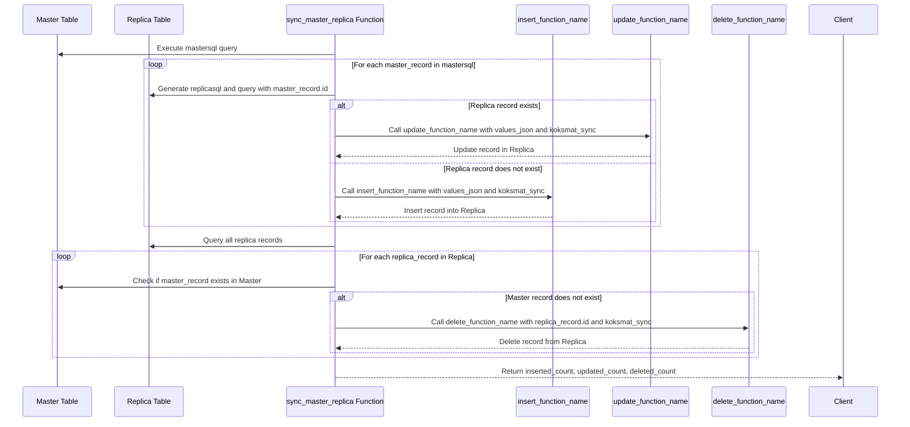

## Overview



The `sync_master_replica` function is a PostgreSQL user-defined function designed to synchronize records between a master dataset and its replica. The function performs three main tasks:

1. **Insertion**: Inserts records into the replica that are present in the master but not in the replica.
2. **Update**: Updates records in the replica that are present in both the master and replica.
3. **Deletion**: Deletes records from the replica that are no longer present in the master.

## Parameters

The function accepts five parameters:

1. **mastersql (text)**: A SQL query string that retrieves the records from the master dataset.
2. **replica_table_name (text)**: The name of the replica table where the synchronization will occur.
3. **insert_function_name (text)**: The name of the function that will handle inserting new records into the replica.
4. **update_function_name (text)**: The name of the function that will handle updating existing records in the replica.
5. **delete_function_name (text)**: The name of the function that will handle deleting records from the replica.

## Return Value

The function returns a table with the following columns:

- `inserted_count (int)`: The number of records inserted into the replica.
- `updated_count (int)`: The number of records updated in the replica.
- `deleted_count (int)`: The number of records deleted from the replica.

## Function Logic

1. **Initialization**:

   - The counts for inserted, updated, and deleted records are initialized to zero.

2. **Query Construction**:

   - A `replicasql` query is dynamically generated to select records from the replica table.

3. **Insert and Update Records**:

   - The function loops through each record returned by the `mastersql` query.
   - Each master record is converted to a JSONB object (`values_json`).
   - The function checks if a corresponding record exists in the replica using the `koksmat_masterdata_id`.
   - If a matching record exists, the `update_function_name` is called to update the record.
   - If no matching record is found, the `insert_function_name` is called to insert a new record.

4. **Delete Records**:

   - The function loops through each record in the replica table.
   - It checks if the corresponding record exists in the master table.
   - If the record does not exist in the master, the `delete_function_name` is called to delete the record from the replica.

5. **Return the Results**:
   - The function returns the counts of inserted, updated, and deleted records.

## Example Usage

```sql
SELECT * FROM sync_master_replica(
    'SELECT id, field1, field2 FROM master_table',
    'replica_table',
    'insert_replica_record',
    'update_replica_record',
    'delete_replica_record'
);
```

## Notes

- The function relies on dynamic SQL execution (`EXECUTE`) to handle varying table and function names.
- The `koksmat_sync` JSONB object is constructed to track synchronization metadata, such as the `master_id`.
- The function assumes that both the master and replica tables share a common identifier (`id`) and that the replica has a field named `koksmat_masterdata_id` which links to the master record.

This function is particularly useful in scenarios where data from a source system (master) needs to be synchronized with a replica system, ensuring that both datasets remain consistent.

```sql


CREATE OR REPLACE FUNCTION sync_master_replica(
    mastersql text,
    replica_table_name text,
    insert_function_name text,
    update_function_name text,
    delete_function_name text
)
RETURNS TABLE(inserted_count int, updated_count int, deleted_count int) AS $$
DECLARE
    master_record record;
    replica_record record;
    values_json jsonb;
    koksmat_sync jsonb;
    replicasql text;
BEGIN
    -- Initialize the counts
    inserted_count := 0;
    updated_count := 0;
    deleted_count := 0;

    -- Generate the replicasql query dynamically
    replicasql := format('SELECT id,koksmat_masterdata_id FROM %I', replica_table_name);

    -- Step 1: Handle updates and inserts
    FOR master_record IN EXECUTE mastersql LOOP
        -- Convert the entire master_record into a JSONB object
        values_json := to_jsonb(master_record);

        -- Create the koksmat_sync JSONB object with the master id
        koksmat_sync := jsonb_build_object('master_id', master_record.id);
        RAISE NOTICE 'Calling match: % WHERE koksmat_masterdata_id = ''%''', replicasql, master_record.id;

        -- Find the corresponding replica record
        EXECUTE format('%s WHERE koksmat_masterdata_id = ''%s''', replicasql, master_record.id) INTO replica_record;
        RAISE NOTICE 'Found %', to_jsonb(replica_record);

        IF replica_record is not null THEN
            values_json := values_json || jsonb_build_object('id', replica_record.id);
            -- If the replica record exists, call the update function
            RAISE NOTICE 'Calling update function: % with id: %, actor: %, values: %, koksmat_sync: %',
                update_function_name, replica_record.id, 'koksmat-sync', values_json, koksmat_sync;
            EXECUTE format('SELECT %I($1::text,  $2::jsonb, $3::jsonb)',
                update_function_name)
            USING 'koksmat-sync'::text,  values_json::jsonb, koksmat_sync::jsonb;
            updated_count := updated_count + 1;
        ELSE
            -- If the replica record does not exist, call the insert function
            RAISE NOTICE 'Calling insert function: % with actor: %, values: %, koksmat_sync: %',
                insert_function_name, 'koksmat-sync', values_json, koksmat_sync;
            EXECUTE format('SELECT %I($1::text, $2::jsonb, $3::jsonb)',
                insert_function_name)
            USING 'koksmat-sync'::text, values_json::jsonb, koksmat_sync::jsonb;
            inserted_count := inserted_count + 1;
        END IF;
    END LOOP;

    -- Step 2: Handle deletions
    FOR replica_record IN EXECUTE replicasql LOOP
        -- Check if the corresponding master record exists
        EXECUTE format('select id from (%s) as s WHERE id = ''%s''', mastersql, replica_record.koksmat_masterdata_id) INTO master_record;

        -- If the master record does not exist, call the delete function
        IF NOT FOUND THEN
            values_json :=jsonb_build_object('id', replica_record.id,'hard',false);

            RAISE NOTICE 'Calling delete function: % with id: %, actor: %, koksmat_sync: %',
                delete_function_name, replica_record.koksmat_masterdata_id, 'koksmat-sync', koksmat_sync;
            EXECUTE format('SELECT %I($1::text,  $2::jsonb,  $3::jsonb)',
                delete_function_name)
            USING 'koksmat-sync'::text,  values_json::jsonb, koksmat_sync::jsonb;
            deleted_count := deleted_count + 1;
        END IF;
    END LOOP;

    -- Return the counts of inserted, updated, and deleted records
    RETURN QUERY SELECT inserted_count, updated_count, deleted_count;
END $$ LANGUAGE plpgsql;

```
