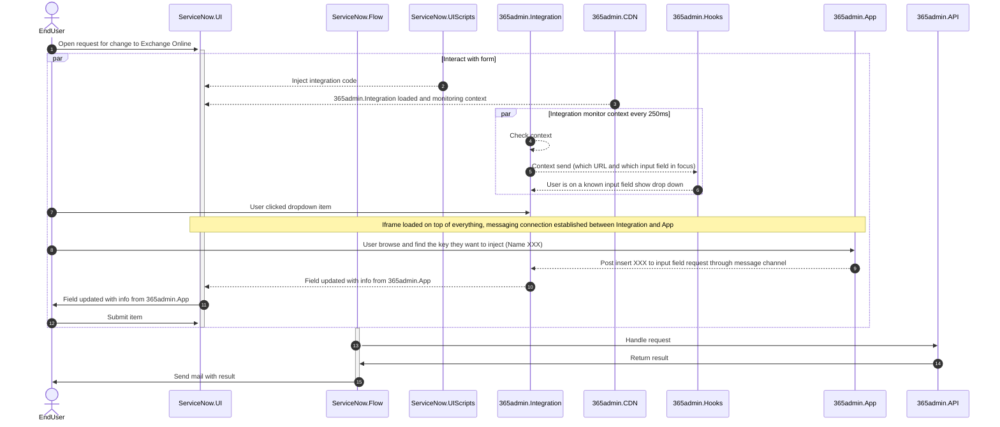

# Exchange Online -  ServiceNow Integration

:::note Idea
This page is under construction
:::

## Introduction
Here is an outline on how it is possible to inject keys from Exchange Online into ServiceNow. The integration is based on the following components:

## Components
### 365admin.Integration

A JavaScript library that is loaded into ServiceNow. It monitors the context and sends it to 365admin.Hooks. It also receives messages from 365admin.App and injects them into the ServiceNow UI.

### 365admin.API

A REST API that handles the requests from ServiceNow. It is hosted on Azure and is secured with Azure AD. 

## Flow



```javascript
document.addEventListener('DOMContentLoaded', function () {
    // Load the integration script
    var script = document.createElement('script');
    script.src = 'https://365admin.azureedge.net/365admin.integration.js';
    document.head.appendChild(script);
});

// The integration script will call this function when it is loaded

```
