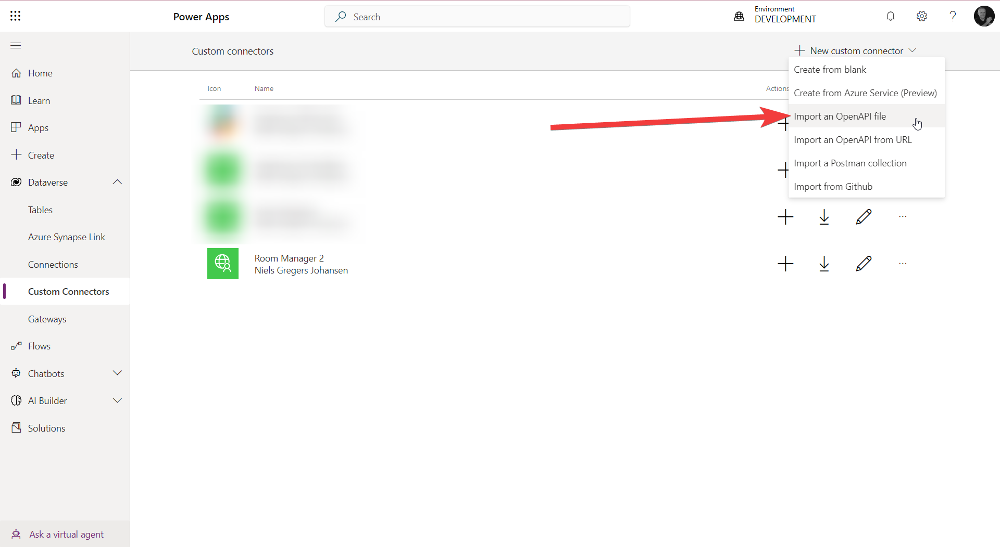

# Room Manager (Custom Connector)

## Registration of Customer Connector

The customer connector is registered in both PowerApps, Power Automate and Logic apps. 

We have an application for making the connector a part of the authorized connectors. The application has been approved and we are now waiting for the connector to be published.

### PowerApps
Within PowerApps you find the Customer Connectors under the Dataverse tab.

Here you need a Open API version 2 file containing the definition of the connector. 

Step 1: Click on the "New Connection" button

Select Import an OpenAPI file

Table of values

| Name | Value |
| --- | --- |
| Client id | 19c72550-d7b8-457f-86c3-7c437c02b2e6  |
| Tenant ID | df96b8c9-51a1-40cf-b8b1-4514be8e9668 |
| Client Secret | Get it from your vendor |
| Resource URL | https://graph.microsoft.com |
