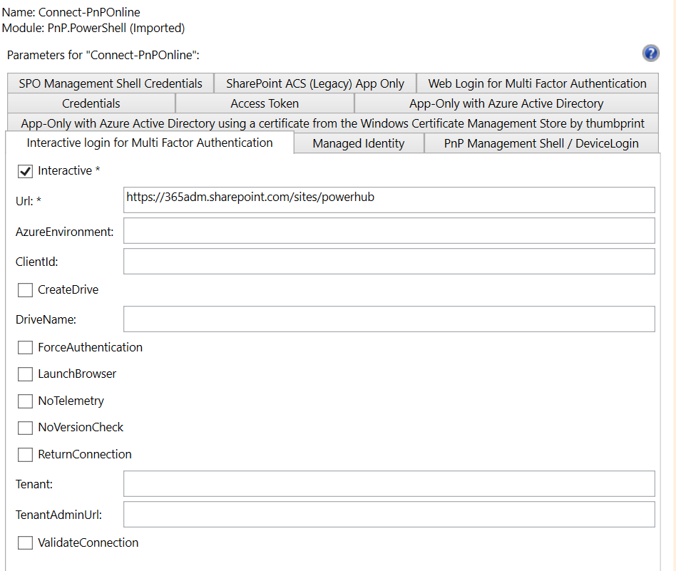

# Copy Operations


## Ingredients

| Icon | Ingredient | Description |
| --- | --- | ---|
| | Certificate  | Private key to a previously registered certificate |
| | SharePoint Site  | Document Library to store the contract and control the metadata (variable) |
| | PowerShell script|  |


## Copy pages from site to site

## Copy list definitions from site to site

## Copy list items from site to site


## Low level
Here we uses PowerShell and especially the PNP PowerShell module to copy data from site to site. The PNP PowerShell module is a great tool to automate SharePoint Online or on-premises.

## How to connect



### Export Site Definitions

https://pnp.github.io/powershell/cmdlets/Get-PnPProvisioningTemplate.html

```powershell
$privateKeyFilePath = Join-Path $PSScriptRoot "certificate.pfx"

Connect-PnPOnline -Url https://**********.sharepoint.com/sites/**********  `
                   -ClientId "******"  `
                   -CertificatePath $privateKeyFilePath  `
                   -Tenant "********"

## Select what to export, a few samples below
# Get-PnPSiteTemplate -Out template.xml
# Get-PnPSiteTemplate -Handlers Lists -Out template.xml -Debug
```


### Import Site Definitions
You now revert the operation and connect to the target site and import the template


```powershell
$privateKeyFilePath = Join-Path $PSScriptRoot "certificate.pfx"

## Select connection options, a few samples below
Connect-PnPOnline -Url https://**********.sharepoint.com/sites/**********  -Interactive

<# Connecting unattended
Connect-PnPOnline -Url https://**********.sharepoint.com/sites/**********  `
                   -ClientId "******"  `
                   -CertificatePath $privateKeyFilePath  `
                   -Tenant "********"
#>
Invoke-PnPSiteTemplate -Path template.xml -Verbose
```
