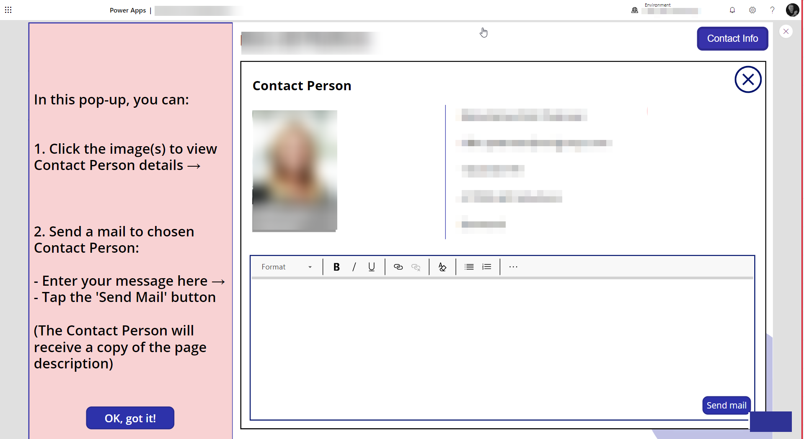
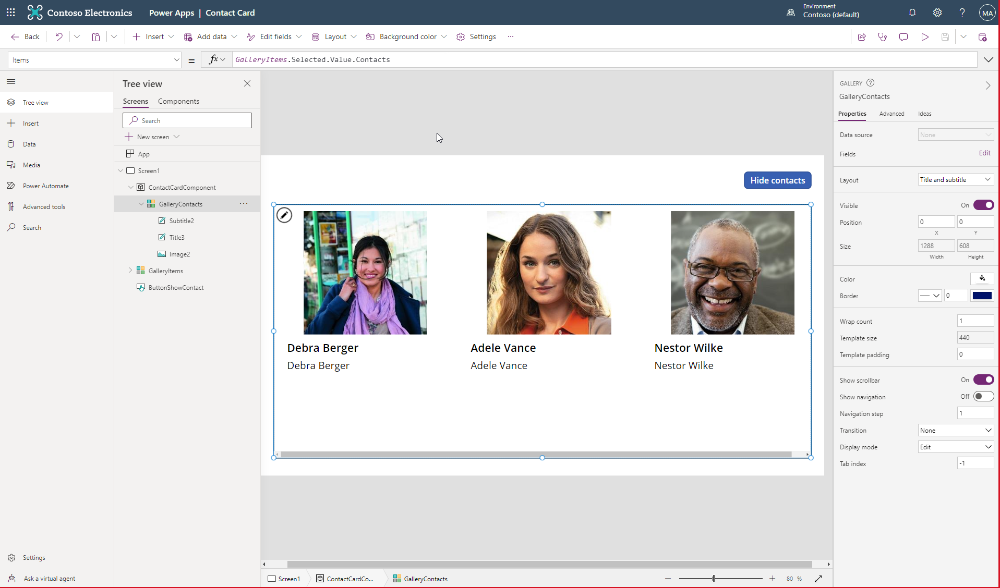
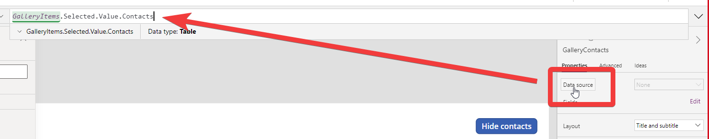

# Contact Card

You can use the contact card for integrating contact information into your site. The contact card is a component that can be used in different ways. You can use it to display contact information for a person or a team. You can also use it to display contact information for a company or a department.




## Connectors
The contact card uses the following connectors:
### Office365Users
PowerApps Office365Users connector can be used to retrieve information about users in your Office 365 tenant. The connector can be used to retrieve information about users, groups, and roles. The connector can also be used to retrieve information about the current user.

### Office365Outlook
PowerApps Office365Outlook connector can be used to retrieve information about your Office 365 Outlook account. The connector can be used to retrieve information about your calendar, contacts, and mail.

## Use Cases
### Show Multiple contacts from a list item
You have a field with multiple contacts on a list item. You want to display the contact information for each contact. 

:::info Use case - Easy contact right person
As a user of the App I want to be able to see the contact information for each contact so that I can easily contact the right person.
:::

:::info Use case - Understand how to the contact card works


:::

Assumption: You have a data set with a field `Contacts`. The field `Contacts` is a multi-select field that contains a list of users. 
The data set is connected to a gallery called `GalleryItems`.

If there is no contacts, you want to disable the `Show Contact` button.

```javascript title="GalleryItems - Items"
[
    {
        Title: "Item with Contacts",
        Contacts: [
            {name: "contact 1"},
            {name: "contact 2"}
        ]
    },
    {
        Title: "Item without Contacts",
        Contacts: []
    }
]
```

```javascript title="ButtonShowContact - DisplayMode"
// This code is controlling the state of the "Show Contact" button
If(CountRows(GalleryItems.Selected.Value.Contacts)>0 ,DisplayMode.Edit,DisplayMode.Disabled)  
```

```javascript title="ButtonShowContact - Text"
If(showContacts,"Show contacts","Hide contacts")
```

```javascript title="ButtonShowContact - OnSelect"
UpdateContext({showContacts:!showContacts})
```

```javascript title="ContactCardComponent - Visible"
showContacts
```



To show the list of contacts on the selected item, insert a Horizontal Gallery control. The gallery should be connected to the `Contacts` field on the selected item. 

```javascript title="HorizontalGalleryContacts - Items"
GalleryItems.Selected.Value.Contacts
```

Insert the value in the Items property of the Horizontal Gallery control.



```javascript title="HorizontalGalleryContacts - Visible"

```

```javascript title="ContactEmail - Text"
ThisItem.Value.email
```

```javascript title="ContactTitle - Text"
ThisItem.Value.name
```

```javascript title="ContactImage - Image"
Office365Users.UserPhotoV2(ThisItem.Value.email)
```


