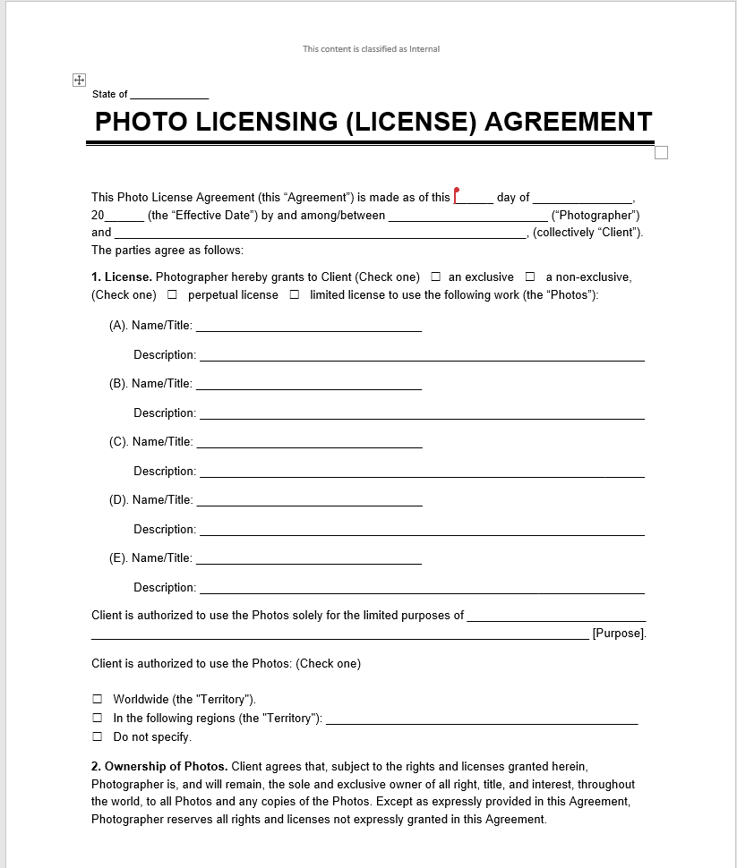
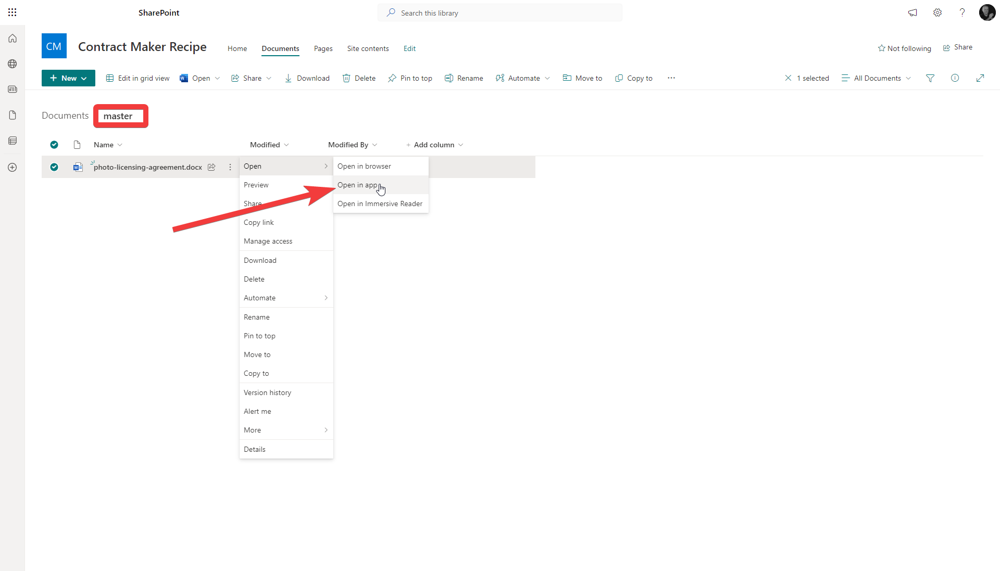
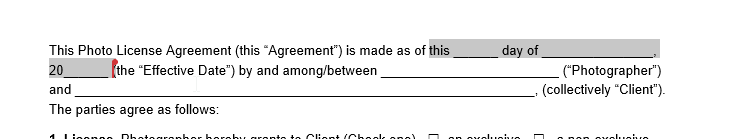
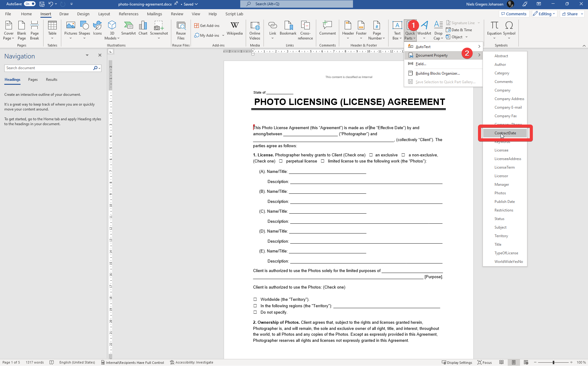
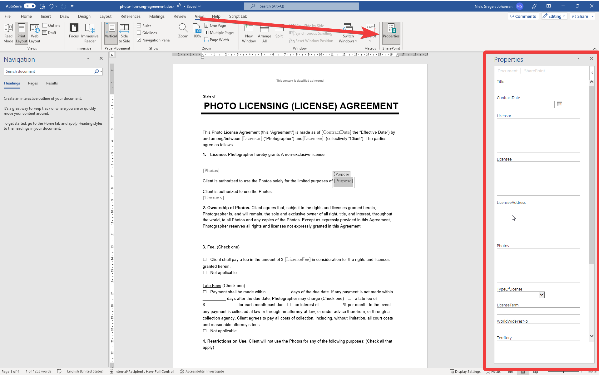

---
# Display h2 to h5 headings
toc_min_heading_level: 2
toc_max_heading_level: 5
tags: ["Contract","Word","PDF Creator"]
---

# Contract Maker

Objective is to create a solution which can take Word document and treat that as a master and then use Word's builtin `Quick Parts` to merge in individual contract data. The validity of the data is supported by a Power App and the contract is created using Power Automate.

import KoksMate from '@site/src/components/KoksMate';

<KoksMate caption="TEst">123</KoksMate>

## Ingredients

| Icon | Ingredient | Description |
| --- | --- | ---|
| | Word document | Word document with Quick Parts - the Master|
| | SharePoint Document Library | Document Library to store the contract and control the metadata (variable) |
| | Power App | Power App to collect data |
| | Power Automate | Power Automate to create the contract |

## Word document

:::info Demo contract
In this recipe we use a sample contract from [Free Photo Licensing Agreement](https://legaltemplates.net/form/photo-licensing-agreement/) [^1] which can be downloaded from [here](https://legaltemplates.net/wp-content/uploads/documents/photo-licensing-agreement/photo-licensing-agreement.docx)
:::

### Identify the "variables" in the Word document
The Word document will be used as a master document and the variables will be replaced with the values from the SharePoint Document Library. The variables are merged into the document using the `Quick Parts` feature in Word.

Review the document and identify the variables that needs to be replaced with values from the SharePoint Document Library. 

:::info Excel to support you
Create an Excel file and make a list of the variables from the Word document.
:::

| Variable | Description | Type | Example |
| --- | --- | --- | --- |
| ContractDate | Date of the contract | Date | 2020-01-01 |
| Licensor | You give the license | Text | John Doe |
| Licensee | You receive the license | Text | Jane Doe |
| Purpose | Purpose | Text | Home page |
| LicenseeAddress | Address of the Licensee | Text | 123 Main Street |
| Photos | List of photos | Text | Photo 1, Photo 2, Photo 3 |
| TypeOfLicense | Type of license | Text |an exclusive license, a non-exclusive license, perpetual license,limited license |
| LicenseTerm | Term of the license | Text | 1 year, 2 years, 3 years |
| WorldWideYesNo | Is the license world wide | Yes/No | Yes |
| Territory | Territory of the license | Text | USA, Europe, Asia |
| Restrictions | Restrictions of the license | Text | No commercial use, No resale, No modification |
| LicenseFee | License fee | Number | 1000 |

### SharePoint Site

If you don't own a SharePoint site, visit your companies guidelines on how to get one created. Out of the box, SharePoint Online offers a self services approach from the SharePoint home center. If you are the owner of a Microsoft Teams, you will implicitly have a SharePoint site created for you, but if might not necessarily be the best place to store your documents, as Microsoft Teams is more of a collaboration tool and can been deleted when there is no longer activity in it. 

:::info Recommendation
We recommend that you create a `SharePoint Communication site`  for your documents.
:::

### SharePoint Document Library
Create a SharePoint Document Library or you might just use the one that is created by default when you create a SharePoint site.

:::info Content Type(s)
If you like to share the same properties across multiple document libraries, you can create a content type and use it across multiple document libraries. [Microsoft Learn](https://learn.microsoft.com/en-us/sharepoint/create-customize-content-type) 
:::

#### Create the columns in the SharePoint Document Library

Create the columns in the SharePoint Document Library. The columns should match the variables in the Word document.

#### Upload the Word document to the SharePoint Document Library

When an Office document have been uploaded to a SharePoint Document Library, the document properties will be automatically populated with the metadata from the SharePoint Document Library.

#### Open the Word document and add the Quick Parts
We will use the document properties to replace the variables in the Word document.

Open the Word document in the Desktop App and add the Quick Parts. For each variable, add a Quick Part and select the corresponding document property.

### Power App
You can remove the need to manually change the properties in the SharePoint list by using a Power App and Power Automate.

### Power App SharePoint Connector
### Power Automate Flow
### Power Automate SharePoint Connector
### Identity of the user
  
## Use Cases

### Maintaining a contract template
### Capturing the contract variables
### "Signing" the contract
### Creating the contract

[^1]: The Free Photo Licensing Agreement is a sample contract from [Legal Templates](https://legaltemplates.net/form/photo-licensing-agreement/). The contract is licensed under a [Creative Commons Attribution 4.0 International License](https://creativecommons.org/licenses/by/4.0/).