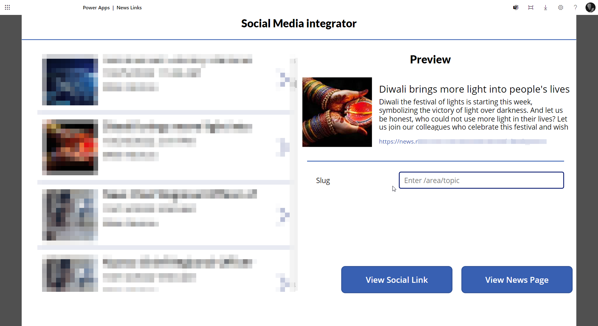

# News Share
Learn how to make ....



:::warning Require Tech assistance
You need to have the [PDNS](../../../pro-tips/services/pdns/index.md) deployed to your infrastructure to make this recipe make sense
:::


## Ingredients

| Icon | Ingredient | Description |
| --- | --- | ---|
| | SharePoint List | List used for sharing Links |
| | Power App | Power App to copy news metadata to PowerLink |
| | Power Automate | Power Automate to publish the link |
| | Blob Storage | Blob Storage to store the image and the link|


## Recipe

### Create the SharePoint List

Create a SharePoint List called `PowerLink` with the following columns:

| Column | Type | Description |
| --- | --- | ---|
| Title | Single line of text | Title of the link |
| Link | Hyperlink or Picture | Link to the news |
| Image | Picture | Image of the news |
| Published | Yes/No | Is the link published? |

### Create the Power App

Create a Power App with the following screens:

#### Screen 1

```javascript
UpdateContext(
    {
        getImageStep1: Split(
            RichTextEditor1.HtmlText,
            ""
                )
            )
        }
    );
    false
)
```


This screen will show the list of links. It will also have a button to add a new link.

### Create the Power Automate

Create a Power Automate to publish the link. It will do the following:

1. Get the link from the SharePoint List
2. Get the image from the SharePoint List
3. Upload the image to the Blob Storage
4. Create a new page in the PDNS

### Create the Blob Storage

Create a Blob Storage to store the image and the link.

## Result


